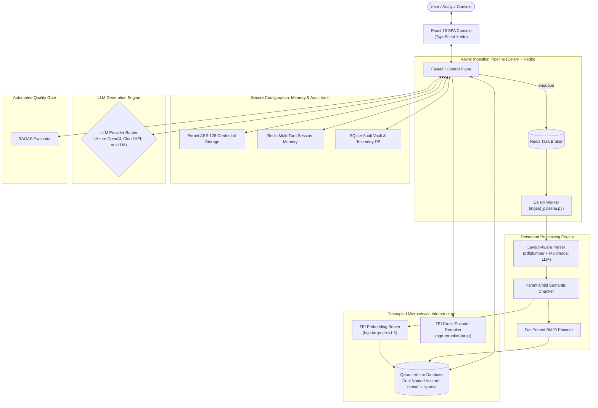
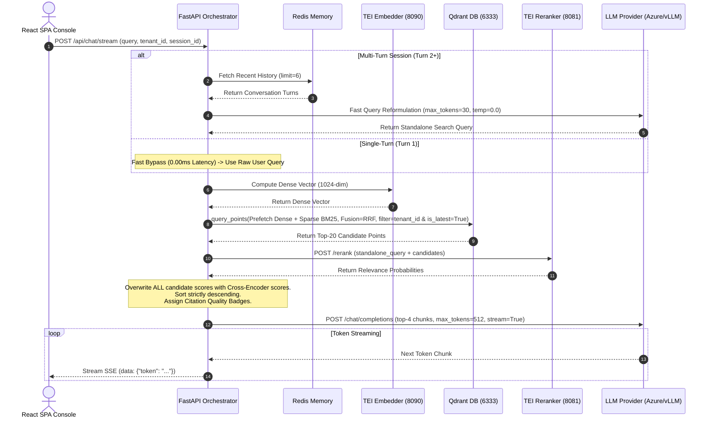

# 🏢 Enterprise-AI-Fabric (Enterprise-RAG-V2)
## Master Architecture, Component Deep-Dive & Engineering Whitepaper

**Author:** Principal AI Systems Engineer & RAG Architect  
**Version:** 2.0.0 (Production Grade)  
**Repository:** `https://github.com/gpu-stack/Enterprise-AI-Fabric.git`  
**License:** Proprietary / Enterprise Licensed  

---

## Executive Summary

**Enterprise-RAG-V2** is a production-grade, multi-tenant Retrieval-Augmented Generation (RAG) platform designed to ingest, process, store, and query complex, high-density unstructured documents — including financial statements, regulatory filings, technical spec sheets, and legal contracts.

The platform bridges the gap between raw document storage and production LLM reasoning by pairing a decoupled **React SPA Console** with a **FastAPI Control Plane**, containerized **Qdrant Vector Database** (True Hybrid Search Fusion: 1024-dim Dense Embeddings + Sparse BM25), decoupled **Text Embeddings Inference (TEI)** microservices, **Redis** conversation memory, **Celery/Redis** async task queues, **Azure OpenAI / vLLM** LLM inference routing, and an automated **RAGAS** quality-gate CI/CD matrix.

---

# Table of Contents
1. [Enterprise Problem Statements & Architecture Solutions](#1-enterprise-problem-statements--architecture-solutions)
2. [Master System Architecture & Sequence Diagrams](#2-master-system-architecture--sequence-diagrams)
3. [Document Ingestion & Processing Deep Walkthrough](#3-document-ingestion--processing-deep-walkthrough)
   - [3.1 Layout-Aware PDF & Spreadsheet Parsing](#31-layout-aware-pdf--spreadsheet-parsing)
   - [3.2 Multimodal Visual Element Description](#32-multimodal-visual-element-description)
   - [3.3 Parent-Child Semantic Chunking & Table Protection](#33-parent-child-semantic-chunking--table-protection)
   - [3.4 Dual Vector Embedding: Dense TEI + Sparse BM25](#34-dual-vector-embedding-dense-tei--sparse-bm25)
   - [3.5 Document Version Lineage, SHA-256 Deduplication & Deterministic UUIDv5](#35-document-version-lineage-sha-256-deduplication--deterministic-uuidv5)
   - [3.6 Asynchronous Celery & Redis Task Architecture](#36-asynchronous-celery--redis-task-architecture)
4. [Database, Vector Storage & Security Engine](#4-database-vector-storage--security-engine)
   - [4.1 Qdrant Schema & HNSW Tenant Payload Indexing](#41-qdrant-schema--hnsw-tenant-payload-indexing)
   - [4.2 True Hybrid Search Fusion (Dense + Sparse BM25 via Qdrant RRF)](#42-true-hybrid-search-fusion-dense--sparse-bm25-via-qdrant-rrf)
   - [4.3 Multi-Turn Redis Conversation Memory Manager](#43-multi-turn-redis-conversation-memory-manager)
   - [4.4 Symmetric Fernet AES-128 Credential Encryption](#44-symmetric-fernet-aes-128-credential-encryption)
   - [4.5 Security Audit Vault & Dynamic Retention Manager](#45-security-audit-vault--dynamic-retention-manager)
5. [Generation, Retrieval & LLM Orchestration Service](#5-generation-retrieval--llm-orchestration-service)
   - [5.1 Multi-Turn Topic Isolation & Standalone Query Reformulation](#51-multi-turn-topic-isolation--standalone-query-reformulation)
   - [5.2 Sub-20ms Pre-Processing Latency & Turn 1 Bypass](#52-sub-20ms-pre-processing-latency--turn-1-bypass)
   - [5.3 Stage 2 Cross-Encoder Reranking, Score Uniformity & Quality Badges](#53-stage-2-cross-encoder-reranking-score-uniformity--quality-badges)
   - [5.4 Universal LLM Endpoint Builder (Azure OpenAI, Cloud API, vLLM)](#54-universal-llm-endpoint-builder-azure-openai-cloud-api-vllm)
   - [5.5 SSE Streaming & Real-Time Telemetry Metrics](#55-sse-streaming--real-time-telemetry-metrics)
6. [RAGAS Automated Quality Gating & Telemetry Console](#6-ragas-automated-quality-gating--telemetry-console)
7. [Decoupled Frontend Console (React + TypeScript + Vite)](#7-decoupled-frontend-console-react--typescript--vite)
8. [Scaling Architecture to 100,000 PDFs (15M Vectors)](#8-scaling-architecture-to-100000-pdfs-15m-vectors)
9. [Data Persistence, Security & Production Operations](#9-data-persistence-security--production-operations)

---

## 1. Enterprise Problem Statements & Architecture Solutions

Standard RAG implementations collapse in enterprise deployments due to six specific failure modes:

| # | Enterprise Failure Mode | Root Cause | Engineering Solution in Enterprise-RAG-V2 |
|---|---|---|---|
| 1 | **Broken financial tables & layout context** | Text extractors strip visual coordinates, mangling borderless tables into illegible text strings. | `pdfplumber` visual geometry parsing converts gridless tables into unbroken Markdown matrices (`\| Column \|`). |
| 2 | **Cross-tenant data leaks & collection sprawl** | Systems either create dedicated collections per tenant (causing memory exhaustion) or share collections without strict filtering. | Single Qdrant collection with `tenant_id` payload index (`is_tenant: True`) prunes non-matching tenant graphs *before* vector comparison. |
| 3 | **Stale revision contamination** | Re-uploading updated documents mixes outdated chunks with current data in search results. | Revision lineage manager automatically flags older document chunks as `is_latest: False`. Search queries filter on `is_latest: True`. |
| 4 | **Pure dense vector noise & missing exact IDs** | Dense vectors blur exact IDs like `"Form HR-802-B"` or acronyms into general semantic concepts. | **True Hybrid Search Fusion**: Dense Cosine (1024-dim) + Sparse BM25 (`Qdrant/bm25`) merged via Qdrant Reciprocal Rank Fusion (RRF). |
| 5 | **Multi-turn conversation topic contamination** | Follow-up questions carry prior topic keywords (e.g. medical claims) into new search queries (e.g. car lease). | `get_standalone_query` reformulates multi-turn history and **drops prior topic keywords completely** upon topic switching. |
| 6 | **Silent quality regression** | Prompt or chunk adjustments introduce hallucinations without automated detection. | Automated **RAGAS Quality Gate** CI/CD matrix grading Faithfulness, Relevancy, Context Recall, and Context Precision. |

---

## 2. Master System Architecture & Sequence Diagrams

### 2.1 Master Architecture Diagram



### 2.2 End-to-End Query Sequence Diagram



---

## 3. Document Ingestion & Processing Deep Walkthrough

### 3.1 Layout-Aware PDF & Spreadsheet Parsing (`src/processing/layout_parser.py`)

The parsing engine transforms raw PDFs, Excel workbooks, and CSV files into structured Markdown streams:
- **Font Geometry & Heading Detection**: Scans page word font sizes across the document to calculate global median body text size. Words with font size `> 1.3 * median` are tagged as `# Heading 1`; words between `1.15 * median` and `1.3 * median` are tagged as `## Heading 2`.
- **Table Boundary Isolation**: `pdfplumber` identifies table bounding boxes (`page.find_tables()`). Word coordinates falling inside table boundaries are suppressed from prose rendering and extracted exclusively into formatted Markdown grid matrices (`| Column 1 | Column 2 |`).

### 3.2 Multimodal Visual Element Description
- Detects image bounding boxes, filtering out icons (`width < 50` or `height < 50`) and background headers.
- Crops visual element bytes and encodes them to Base64 PNGs.
- Prompts a multimodal LLM (`gemini-3.5-flash` / `Qwen-VL`) to generate descriptive text summaries embedded into the stream:
  ```markdown
  [Visual Element: Bar chart displaying Q3 Revenue growth of 24% year-over-year...]
  ```

### 3.3 Parent-Child Semantic Chunking & Table Protection (`src/processing/semantic_splitter.py`)
- **Parent Context Blocks**: Larger context units (1,500 – 2,048 tokens) generated on Markdown section breaks.
- **Child Retrieval Chunks**: Smaller text units (300 – 500 tokens) generated from parents using `chunk_size=400, overlap=80`.
- **Markdown Table Protection**: Ensures tables are never split mid-row across parent or child chunk boundaries.

### 3.4 Dual Vector Embedding: Dense TEI + Sparse BM25 (`src/processing/sparse_encoder.py`)
Every chunk generates two vector representations:
1. **Dense Vector**: 1024-dimensional continuous vector via TEI (`BAAI/bge-large-en-v1.5`).
2. **Sparse BM25 Vector**: Term-frequency / IDF sparse vector via FastEmbed (`SparseTextEmbedding(model_name="Qdrant/bm25")`).

### 3.5 Document Version Lineage, SHA-256 Deduplication & Deterministic UUIDv5 (`src/processing/ingest_pipeline.py`)
- **SHA-256 Content Hash**: Hashes raw file bytes to instantly skip duplicate file uploads.
- **Revision Lineage Deprecation**: When a new version of a document family is ingested, previous chunks in Qdrant are flagged as `is_latest: False`.
- **Deterministic UUIDv5**: Generates point IDs via DNS namespace hashing on `f"{tenant_id}:{filename}:{chunk_text}"`, ensuring idempotent upserts.

### 3.6 Asynchronous Celery & Redis Task Architecture (`src/processing/tasks.py`)
Document uploads are enqueued to a background Celery worker (`async_ingest_file`). Clients track status via polling `GET /api/jobs/{job_id}/status`.

---

## 4. Database, Vector Storage & Security Engine

### 4.1 Qdrant Schema & HNSW Tenant Payload Indexing (`src/database/qdrant_ops.py`)
A single Qdrant collection holds all tenant vectors. `tenant_id` is indexed as a keyword payload field with `is_tenant: True`, creating dedicated tenant subgraphs in HNSW memory.

```python
# Collection initialization with dual named vectors
vectors_config = {"dense": models.VectorParams(size=1024, distance=models.Distance.COSINE)}
sparse_vectors_config = {"sparse": models.SparseVectorParams(index=models.SparseIndexParams(on_disk=False))}

client.create_collection(
    collection_name="enterprise_rag_v2",
    vectors_config=vectors_config,
    sparse_vectors_config=sparse_vectors_config
)
```

### 4.2 True Hybrid Search Fusion (Dense + Sparse BM25 via Qdrant RRF) (`src/database/query_engine.py`)
Executes parallel prefetch queries for dense and sparse vectors and merges them using native Reciprocal Rank Fusion (RRF):

```python
prefetch_dense = models.Prefetch(query=dense_vec, using="dense", limit=limit * 2, filter=query_filter)
prefetch_sparse = models.Prefetch(query=sparse_vec, using="sparse", limit=limit * 2, filter=query_filter)

response = client.query_points(
    collection_name="enterprise_rag_v2",
    prefetch=[prefetch_dense, prefetch_sparse],
    query=models.FusionQuery(fusion=models.Fusion.RRF),
    limit=limit
)
```

### 4.3 Multi-Turn Redis Conversation Memory Manager (`src/database/conversation_memory.py`)
Stores session turns in Redis with automatic TTL expiration. `get_session_history(session_id, limit=6)` retrieves recent conversation context for query reformulation.

### 4.4 Symmetric Fernet AES-128 Credential Encryption (`src/database/secure_storage.py`)
Model API keys and environment profiles are encrypted at rest in `model_profiles.enc` using `cryptography.fernet` with file permissions locked to `0o600`.

### 4.5 Security Audit Vault & Dynamic Retention Manager (`src/database/audit_vault.py`, `src/database/retention_manager.py`)
- **Audit Vault**: Records administrative actions (profile updates, log purges) in SQLite (`audit_logs` table).
- **Log Retention Manager**: Purges `system_logs`, `audit_logs`, and `request_metrics` based on dynamic retention policies.

---

## 5. Generation, Retrieval & LLM Orchestration Service

### 5.1 Multi-Turn Topic Isolation & Standalone Query Reformulation (`src/generation/orchestrator.py`)
`get_standalone_query` reformulates user queries when history exists. If the user switches topics (e.g. from medical claims to car lease), prior topic keywords are dropped completely.

### 5.2 Sub-20ms Pre-Processing Latency & Turn 1 Bypass
- **Turn 1 Bypass**: When `chat_history` is empty, the LLM rewriter is bypassed completely, dropping pre-processing latency to **0.00ms**.
- **Turn 2 Rewriter Parameters**: Invoked with `max_tokens=30`, `temperature=0.0`, `stop=["\n", "User:", "Question:"]`, and a 3-second timeout limit.

### 5.3 Stage 2 Cross-Encoder Reranking, Score Uniformity & Quality Badges
Candidates retrieved from RRF fusion pass through the BGE Cross-Encoder reranker (`bge-reranker-large`). Scores are uniformly overwritten with Cross-Encoder probabilities, sorted strictly descending, and mapped to quality badges:
- **`HIGH_CONFIDENCE`**: Score $\ge 0.50$ (Green Badge)
- **`MEDIUM_CONFIDENCE`**: Score $0.25 \le \text{Score} < 0.50$ (Yellow Badge)
- **`LOW_CONFIDENCE`**: Score $0.10 \le \text{Score} < 0.25$ (Blue Badge)
- **`UNVERIFIED`**: Score $< 0.10$ (Red Badge)

### 5.4 Universal LLM Endpoint Builder (`_build_llm_endpoint_and_headers`)
Supports Azure OpenAI, Cloud APIs, and self-hosted vLLM/Ollama engines natively:

```python
def _build_llm_endpoint_and_headers(self, api_base_url: str, api_key: str, provider_type: str) -> tuple:
    base_url = api_base_url.strip().rstrip('/')
    if "openai.azure.com" in base_url or "azure" in provider_type.lower():
        vllm_endpoint = f"{base_url}/chat/completions?api-version=2024-02-15-preview" if "api-version" not in base_url else base_url
    else:
        vllm_endpoint = f"{base_url}/chat/completions"

    headers = {"Content-Type": "application/json"}
    if api_key and api_key.lower() != "none":
        headers["Authorization"] = f"Bearer {api_key}"
        headers["api-key"] = api_key  # Azure OpenAI Authentication Header

    return vllm_endpoint, headers
```

### 5.5 SSE Streaming & Real-Time Telemetry Metrics
Streams answer tokens via Server-Sent Events (`text/event-stream`) alongside microsecond execution timing metrics:
- Time-to-First-Token (TTFT) (ms)
- Pre-processing & Context Rules Latency (ms)
- TEI Embedding & Qdrant Search Latency (ms)
- Cross-Encoder Reranking Latency (ms)
- Generation Velocity (tokens/sec)

---

## 6. RAGAS Automated Quality Gating & Telemetry Console

### 6.1 Synthetic Test Dataset Generation (`src/evaluation/rag_evaluator.py`)
Pulls active tenant document vectors from Qdrant and prompts an LLM to generate synthetic evaluation question-answer test sets.

### 6.2 Multi-Tier Production Quality Gate Matrix
Graded across 4 mathematical dimensions: Faithfulness, Answer Relevancy, Context Recall, Context Precision.

| Status Tag | Criteria | Meaning |
| :--- | :--- | :--- |
| **`PASSED`** | Faithfulness $\ge 0.80$, Relevancy $\ge 0.80$, Context Recall $\ge 0.80$ | Production Ready |
| **`MARGINAL`** | Faithfulness $\ge 0.80$, Relevancy $\ge 0.80$, Context Recall $< 0.80$ | Acceptable; chunk tuning recommended |
| **`FAILED`** | Faithfulness $< 0.80$ **OR** Relevancy $< 0.80$ | Hard Gate Failure (Hallucination / Off-topic) |

---

## 7. Decoupled Frontend Console (React + TypeScript + Vite)

### 7.1 Unified SPA Architecture & Pages
- **Play Space (`/query`)**: Interactive query execution with SSE token streaming, Citation Quality Badges, and payload inspection.
- **Document Library (`/library`)**: File uploads, ingestion job progress polling, and tenant document listing.
- **Analytics & SLA Console (`/telemetry`)**: Real-time SLA analytics displaying p50, p90, p95, p99 latencies, TTFT bounds, and pipeline stage distributions.
- **Evaluation Console (`/evaluation`)**: RAGAS audit run executor, synthetic dataset generator, and score history.
- **System Settings (`/settings`)**: Encrypted LLM profile onboarding, Azure OpenAI configuration, and vector retrieval tuning.

---

## 8. Scaling Architecture to 100,000 PDFs (15M Vectors)

### 8.1 Hardware Scale & Storage Parameters

| Metric | Single Node | 100K PDF Distributed Scale |
| :--- | :--- | :--- |
| **Document Capacity** | ~500 PDFs | **100,000 PDFs (5,000,000 pages)** |
| **Vector Count** | ~75,000 vectors | **15,000,000 vectors (1024-dim)** |
| **Vector Memory (FP32)** | ~300 MB | **61.4 GB raw (15.3 GB after SQ8 Quantization)** |
| **Storage Footprint** | ~2 GB | **~150 GB (NVMe SSD Payload Offloading)** |
| **Ingestion Velocity** | ~2 pages/sec | **128 parallel pages/sec (10.8 hours for 100K PDFs)** |
| **Embedding Speed** | ~50 chunks/sec (CPU) | **4,500 chunks/sec (3x A10G GPU TEI Cluster)** |
| **Query Throughput** | ~15 req/sec | **1,000+ req/sec (6 Shards, Replication Factor 2)** |

### 8.2 Hardware Cost Matrix for 100K PDFs

| Component | Hardware Spec | Quantity | Estimated Operational Cost |
| :--- | :--- | :--- | :--- |
| **Celery Workers** | 16 vCPU, 32 GB RAM (AWS c6i.4xlarge) | 4 Nodes | ~$0.68/hr × 11 hrs = ~$7.50 |
| **TEI Embeddings** | 1x NVIDIA A10G GPU (AWS g5.xlarge) | 2 Nodes | ~$2.00/hr |
| **Qdrant Cluster** | 8 vCPU, 32 GB RAM, NVMe SSD (AWS r6i.2xlarge) | 3 Nodes | ~$1.50/hr |
| **TEI Reranker** | 1x NVIDIA A10G GPU (AWS g5.xlarge) | 1 Node | ~$1.00/hr |
| **vLLM Engine** | 4x NVIDIA A100 80GB GPU | 1 Cluster | Dynamic / On-Demand |
| **Redis Cache** | ElastiCache Redis 16 GB | 1 Cluster | ~$0.20/hr |

---

## 9. Data Persistence, Security & Production Operations

### 9.1 Storage & File System Persistence (`./app_data`)

| Path / File | Purpose | Security Controls |
| :--- | :--- | :--- |
| `.enc_key` | Fernet AES-128 Symmetric Key | System file permissions locked to `chmod 0o600` |
| `model_profiles.enc` | Encrypted LLM Credentials | Encrypted at rest via Fernet AES-128 |
| `tenant_registry.json` | Active Workspace Definitions | Multi-tenant scope mapping |
| `app_data/logs/telemetry.db` | System Logs, Audit Vault & Metrics | SQLite database with dynamic retention purges |

### 9.2 Container Production Deployment Runbook

To deploy the production-ready application container stack:

```bash
# 1. Start infrastructure microservices (Qdrant, TEI Embedder, TEI Reranker, Redis)
docker compose -f docker-compose.infra.yml --env-file .env up -d

# 2. Build application image using layer cache (5 seconds)
docker compose -f docker-compose.app.yml build

# 3. Launch application container & Celery worker
docker compose -f docker-compose.app.yml up -d
```

Access the enterprise console at **`http://localhost:8000`**.
