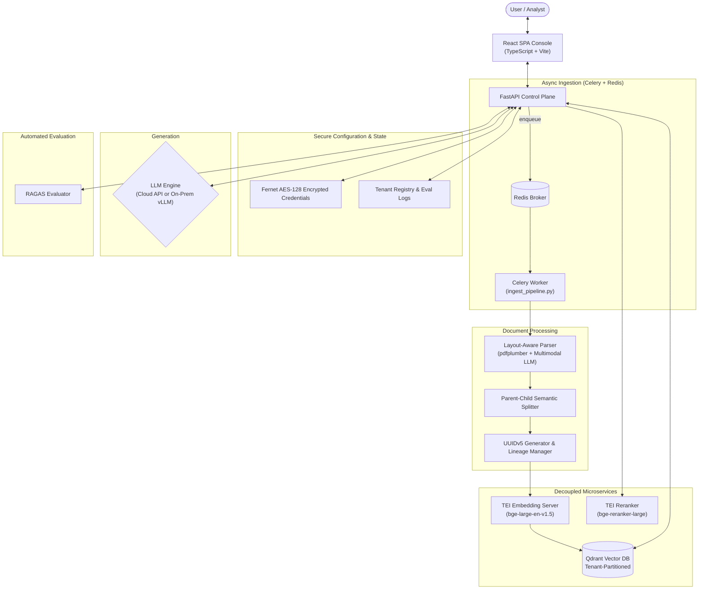

# 🏢 Enterprise-AI-Fabric

**A decoupled, multi-tenant document intelligence & retrieval platform** (repo: `Enterprise-AI-Fabric`)

[](https://python.org)
[](https://fastapi.tiangolo.com)
[](https://react.dev)
[](https://www.typescriptlang.org/)
[](https://qdrant.tech)
[](https://www.docker.com/)

Enterprise-RAG-V2 is a production-grade, multi-tenant Retrieval-Augmented Generation (RAG) platform for ingesting, processing, and querying complex, high-density unstructured documents — financial statements, regulatory filings, technical spec sheets, and legal contracts.

It pairs a decoupled **React SPA console** with a **FastAPI control plane**, a containerized **Qdrant** vector store, decoupled **TEI** embedding/reranking microservices, **Celery/Redis** async ingestion, vLLM/cloud LLM generation, and an automated **RAGAS** quality-gate.

---

## Table of Contents
1. [What Problem Does This Solve?](#1-what-problem-does-this-solve)
2. [How It Solves Them — Architecture Pillars](#2-how-it-solves-them--architecture-pillars)
3. [Master System Architecture](#3-master-system-architecture)
4. [Component Documentation](#4-component-documentation)
5. [Technology Stack](#5-technology-stack)
6. [Quick Start (Fixed & Verified)](#6-quick-start-fixed--verified)
7. [Scaling to 100,000 PDFs](#7-scaling-to-100000-pdfs)
8. [Data Persistence](#8-data-persistence)
9. [Current Status & Honest Roadmap](#9-current-status--honest-roadmap)

---

## 1. What Problem Does This Solve?

Standard RAG implementations break down in enterprise settings for five specific reasons:

| # | Problem | Why It Happens |
|---|---|---|
| 1 | **Broken financial tables & layout context** | Standard text extractors strip layout coordinates, mangling borderless columns and balance sheets into illegible strings. |
| 2 | **Cross-department data leaks** | Multi-tenant systems are usually forced to choose between collection sprawl (one Qdrant collection per tenant) or risking cross-tenant leakage in a shared one. |
| 3 | **Stale revision contamination** | Re-uploading an updated policy or Q3 report causes the retriever to mix outdated chunks with the current ones. |
| 4 | **Dense vector noise** | Pure cosine similarity returns semantically related but contextually irrelevant passages, degrading answer accuracy. |
| 5 | **Silent quality regression** | Changing a prompt, chunk size, or model can quietly introduce hallucinations with no automated way to catch it. |

**How** each of these is actually solved — not just claimed — is detailed in Section 2, and proven out in the source: `src/processing/`, `src/database/`, `src/generation/`, and `src/evaluation/`.

---

## 2. How It Solves Them — Architecture Pillars

### 🔒 Strict Logical Multi-Tenancy
A single Qdrant collection holds every tenant's vectors. Isolation is enforced with a `tenant_id` payload keyword index (`is_tenant: True`), so Qdrant prunes non-matching tenant subgraphs *before* running any vector comparison — no collection sprawl, no cross-tenant leakage. → [`src/database/README.md`](src/database/README.md)

### 📐 Layout-Aware PDF & Borderless Table Extraction
`pdfplumber` recovers visual geometry — row/column bounding boxes — and reconstructs gridless tables as clean Markdown matrices instead of flattened text. → [`src/processing/PARSING.md`](src/processing/PARSING.md)

### 🖼️ Multimodal Visual Element Description
Embedded charts and diagrams are cropped, base64-encoded, and sent to a multimodal LLM (Gemini / Qwen-VL) for a text description that's merged back into the document stream. → [`src/processing/PARSING.md`](src/processing/PARSING.md)

### 🧱 Parent-Child Document Hierarchy
Small **child chunks** (~300–500 tokens) match queries precisely; their associated **parent block** (~1,500–2,048 tokens) is what actually gets sent to the LLM, so retrieval precision and context completeness stop being a trade-off. → [`src/processing/CHUNKING.md`](src/processing/CHUNKING.md)

### 🔄 Document Revision Lineage & Deterministic Deduplication
Chunk IDs are deterministic UUIDv5 hashes of `tenant_id:filename:chunk_text`, so re-ingesting identical content overwrites cleanly. Ingesting a new version flips older chunks to `is_latest: False` instead of deleting them — audit history is preserved, but live queries only ever see current data. → [`src/processing/INGESTION.md`](src/processing/INGESTION.md)

### 🔐 Symmetric Fernet AES-128 Credential Encryption
Model API keys and connection profiles are encrypted at rest (`model_profiles.enc`) with a key file locked to `0o600`. → [`src/database/README.md`](src/database/README.md)

### 🎯 Two-Stage Retrieval with Cross-Encoder Reranking
Dense vector search (`bge-large-en-v1.5`) hands its top-K candidates to a TEI cross-encoder reranker (`bge-reranker-large`); anything below `RERANKER_SCORE_THRESHOLD` (default `0.40`) is dropped. → [`src/generation/README.md`](src/generation/README.md)

### 📊 Automated RAGAS Quality Gating
A synthetic QA generator + RAGAS scoring engine grades every pipeline change against Faithfulness, Answer Relevancy, Context Recall, and Context Precision, producing a `PASSED` / `MARGINAL` / `FAILED` verdict. → [`src/evaluation/README.md`](src/evaluation/README.md)

---

## 3. Master System Architecture



---

## 4. Component Documentation

| Component | Scope | Docs |
|---|---|---|
| **Document Parsing** | Layout geometry, table isolation, multimodal chart description | [`src/processing/PARSING.md`](src/processing/PARSING.md) |
| **Semantic Chunking** | Parent-child hierarchy, table protection, TEI embedding | [`src/processing/CHUNKING.md`](src/processing/CHUNKING.md) |
| **Ingestion Pipeline** | Dedup, UUIDv5, revision lineage, async Celery tasks | [`src/processing/INGESTION.md`](src/processing/INGESTION.md) |
| **Processing Overview** | End-to-end processing service architecture | [`src/processing/README.md`](src/processing/README.md) |
| **Vector Database & Storage** | Qdrant schema, tenant indexing, encryption | [`src/database/README.md`](src/database/README.md) |
| **Generation & Retrieval** | Query filtering, reranking, LoRA fallback, SSE streaming | [`src/generation/README.md`](src/generation/README.md) |
| **RAGAS Evaluation** | Synthetic QA, quality gate matrix | [`src/evaluation/README.md`](src/evaluation/README.md) |
| **React Frontend** | Console UI, telemetry, diagnostics | [`frontend/README.md`](frontend/README.md) |
| **100K PDF Scaling** | Distributed workers, GPU TEI farms, Qdrant sharding | [`docs/100K_PDF_SCALING_ARCHITECTURE.md`](docs/100K_PDF_SCALING_ARCHITECTURE.md) |

> All links above are repo-relative and resolve correctly on GitHub. (The previous README pointed to an absolute local file path — fixed here.)

---

## 5. Technology Stack

| Layer | Technology | Role |
|---|---|---|
| Frontend | React 18 + TypeScript + Vite | SSE-streaming console UI |
| Backend API | FastAPI + Python 3.11 + Uvicorn | Control plane & orchestrator |
| Async Task Queue | Celery + Redis | Background document ingestion |
| Vector Database | Qdrant 1.9+ | Multi-tenant vector store |
| Embedding Engine | TEI (`bge-large-en-v1.5`) | 1024-dim dense embeddings |
| Reranker Engine | TEI (`bge-reranker-large`) | Cross-encoder relevance scoring |
| Document Parser | `pdfplumber` + Pandas | Layout-aware table/text extraction |
| Multimodal Vision | Gemini / Qwen-VL | Chart & diagram description |
| Semantic Splitter | LangChain Experimental + `tiktoken` | Parent-child chunking |
| Security | `cryptography` (Fernet AES-128) | Credential encryption at rest |
| Evaluation | RAGAS | Automated quality gating |

---

## 6. Quick Start (Fixed & Verified)

> The previous version of this README told you to run `docker compose up -d` to "start the application" — but the root `docker-compose.yml` only defines **Redis** and the **Celery worker**, not the FastAPI/React app itself, and the Celery worker image tag didn't match the app's build tag. The steps below were verified against the actual compose files and Dockerfile and work end-to-end.

### Prerequisites
- Docker Engine 20.10+ and Compose v2.0+
- 8 GB RAM minimum (16 GB recommended)
- NVIDIA GPU + `nvidia-container-toolkit` (optional, for GPU-accelerated embedding/reranking)

### Step 1 — Configure environment
```bash
cp .env.docker .env
```
Edit `.env` and pick the scenario that matches your setup (external host services, local Docker network, or a remote server) — the file has all three templated. Note: `.env.example` only lists a handful of variables; the full set (chunk size, reranker threshold, top-k, LLM mode, etc.) is documented in [`src/config.py`](src/config.py) and worth reviewing before a production run.

### Step 2 — Start the infrastructure microservices (Qdrant, embedder, reranker)
```bash
# CPU-only
docker compose -f docker-compose.infra.yml --env-file .env up -d

# or, with an NVIDIA GPU
docker compose -f docker-compose.infra-gpu.yml --env-file .env up -d
```

### Step 3 — Build the application image
Build it **before** starting Redis/Celery — the Celery worker service reuses this image and will fail to start if it doesn't exist yet:
```bash
docker build -t enterprise-rag-app-v2:latest .
```
(This tag must match the `image:` value in `docker-compose.yml`. If you rename it, update the compose file too.)

### Step 4 — Start Redis + the Celery worker (async ingestion)
This is the step the original Quick Start left out — without it, uploaded documents have no worker to process them:
```bash
docker compose --env-file .env up -d
```
This starts `redis` and `celery_worker` (the latter running `celery -A src.processing.tasks.celery worker`), both attached to the `llm-infra-net` Docker network created in Step 2.

### Step 5 — Run the application container
```bash
docker run -d -p 8000:8000 \
  --env-file .env \
  -v $(pwd)/app_data:/app/data \
  --network llm-infra-net \
  --name enterprise-rag-app \
  enterprise-rag-app-v2:latest
```
`--network llm-infra-net` is required so the app container can resolve `rag-qdrant`, `redis`, etc. by container name — it was missing from the previous instructions, which would have left the app unable to reach any of the other services in Scenario B.

### Step 6 — Open the console
```
http://localhost:8000
```

Uploads submitted from the console are enqueued to Celery (Step 4's worker) and processed asynchronously — check job status via `GET /api/jobs/{job_id}/status`.

---

## 7. Scaling to 100,000 PDFs

At enterprise scale (~100K PDFs, ~5M pages, ~15M vectors), a single-node deployment is not viable. Full details, diagrams, and a cost table live in [`docs/100K_PDF_SCALING_ARCHITECTURE.md`](docs/100K_PDF_SCALING_ARCHITECTURE.md); the key numbers:

| Metric | Value |
|---|---|
| Total vectors (1024-dim) | ~15,000,000 |
| Raw vector memory (FP32) | ~61.4 GB |
| After Scalar Quantization (SQ8) | ~15.3 GB (<1% recall loss) |
| Total storage budget (vectors + payload) | ~150 GB |
| Parsing throughput (128 parallel pages/sec) | ~5M pages in ~10.8 hours |
| Embedding throughput (3× A10G GPUs) | ~15M chunks in ~2.7 hours |
| Query throughput (sharded Qdrant, 6 shards / RF 2) | 1,000+ queries/sec |

**Key interventions:** move ingestion from single-node synchronous parsing to a Celery/Ray worker pool with autoscaling; shard Qdrant across 3+ nodes with SQ8 quantization and on-disk payload storage; scale TEI embedding/reranking behind GPU pools; add a Redis semantic query cache (cosine similarity > 0.96) to skip re-computation on repeated questions; run vLLM with tensor parallelism and continuous batching for concurrent generation.

---

## 8. Data Persistence

Encryption keys, connection profiles, tenant metadata, and evaluation logs are stored in `./app_data` (mounted to `/app/data` in the container):

| File | Contents |
|---|---|
| `.enc_key` | Fernet AES-128 symmetric key (`chmod 0o600`) |
| `model_profiles.enc` | Encrypted LLM deployment credentials |
| `tenant_registry.json` | Tenant scope definitions |
| `eval_runs.json` | Historical RAGAS run logs |

Back up the system state by copying `./app_data`.

---

## 9. Current Status & Honest Roadmap

This section exists so the README doesn't overclaim. Verified against the current codebase:

**Already implemented:**
- Async ingestion via Celery + Redis (wired into `POST /api/tenants/{tenant_id}/ingest`)
- Multi-tenant Qdrant isolation, Fernet-encrypted credentials, UUIDv5 lineage
- Two-stage retrieval (dense + reranker), SSE streaming, LoRA fallback routing
- RAGAS automated quality gate

**Known gaps (tracked in `improvement_plan.md`):**
- No authentication/authorization layer on the FastAPI endpoints yet (no JWT/API-key middleware)
- Default deployment runs a single Qdrant node — the sharded/replicated cluster described in Section 7 is a scaling target, not the current default
- Retrieval is dense-vector only; hybrid (dense + BM25 sparse) search is planned
- Evaluation history is stored in a flat `eval_runs.json` rather than a database

See `improvement_plan.md` for the full prioritized backlog.
