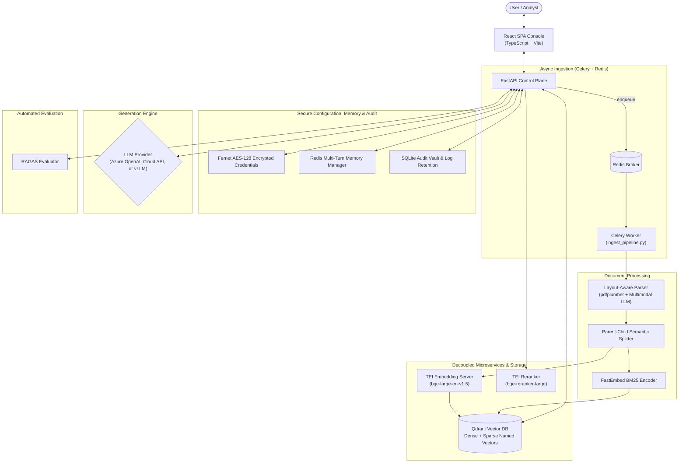

# 🏢 Enterprise-AI-Fabric

**A decoupled, multi-tenant document intelligence & retrieval platform** (repo: `Enterprise-AI-Fabric`)

[](https://python.org)
[](https://fastapi.tiangolo.com)
[](https://react.dev)
[](https://www.typescriptlang.org/)
[](https://qdrant.tech)
[](https://www.docker.com/)

Enterprise-RAG-V2 is a production-grade, multi-tenant Retrieval-Augmented Generation (RAG) platform for ingesting, processing, and querying complex, high-density unstructured documents — financial statements, regulatory filings, technical spec sheets, and legal contracts.

It pairs a decoupled **React SPA console** with a **FastAPI control plane**, a containerized **Qdrant** vector store (True Hybrid Search Fusion: Dense + Sparse BM25), decoupled **TEI** embedding/reranking microservices, **Redis** conversation memory, **Celery/Redis** async ingestion, Azure OpenAI / vLLM generation, and an automated **RAGAS** quality-gate.

---

## Table of Contents
1. [What Problem Does This Solve?](#1-what-problem-does-this-solve)
2. [How It Solves Them — Architecture Pillars](#2-how-it-solves-them--architecture-pillars)
3. [Master System Architecture](#3-master-system-architecture)
4. [Component Documentation](#4-component-documentation)
5. [Technology Stack](#5-technology-stack)
6. [Quick Start (Fixed & Verified)](#6-quick-start-fixed--verified)
7. [Scaling to 100,000 PDFs](#7-scaling-to-100000-pdfs)
8. [Data Persistence & Security](#8-data-persistence--security)
9. [Current Status & Honest Roadmap](#9-current-status--honest-roadmap)

---

## 1. What Problem Does This Solve?

Standard RAG implementations break down in enterprise settings for six specific reasons:

| # | Problem | Why It Happens |
|---|---|---|
| 1 | **Broken financial tables & layout context** | Standard text extractors strip layout coordinates, mangling borderless columns and balance sheets into illegible strings. |
| 2 | **Cross-department data leaks** | Multi-tenant systems are usually forced to choose between collection sprawl (one Qdrant collection per tenant) or risking cross-tenant leakage in a shared one. |
| 3 | **Stale revision contamination** | Re-uploading an updated policy or Q3 report causes the retriever to mix outdated chunks with the current ones. |
| 4 | **Pure Dense Vector Noise & Code Misses** | Pure cosine similarity misses exact form IDs, policy numbers, or acronyms while returning semantically near chunks. |
| 5 | **Multi-Turn Topic Contamination** | Asking a new question on a different topic carries over old history keywords into vector search, causing off-topic hallucinations. |
| 6 | **Silent quality regression** | Changing a prompt, chunk size, or model can quietly introduce hallucinations with no automated way to catch it. |

**How** each of these is actually solved — not just claimed — is detailed in Section 2, and proven out in the source: `src/processing/`, `src/database/`, `src/generation/`, and `src/evaluation/`.

---

## 2. How It Solves Them — Architecture Pillars

### 🔀 True Hybrid Search Fusion (Dense + Sparse BM25)
Combines **Dense Vector Embeddings** (`bge-large-en-v1.5`, 1024-dim Cosine) with **Sparse Lexical Embeddings** (`fastembed.SparseTextEmbedding` via `Qdrant/bm25`). Merges candidate rankings using Qdrant's native **Reciprocal Rank Fusion (RRF)** for maximum keyword and semantic recall. → [`HYBRID_SEARCH.md`](HYBRID_SEARCH.md)

### 🔒 Strict Logical Multi-Tenancy
A single Qdrant collection holds every tenant's vectors. Isolation is enforced with a `tenant_id` payload keyword index (`is_tenant: True`), so Qdrant prunes non-matching tenant subgraphs *before* running any vector comparison — no collection sprawl, no cross-tenant leakage. → [`src/database/README.md`](src/database/README.md)

### 📐 Layout-Aware PDF & Borderless Table Extraction
`pdfplumber` recovers visual geometry — row/column bounding boxes — and reconstructs gridless tables as clean Markdown matrices instead of flattened text. → [`src/processing/PARSING.md`](src/processing/PARSING.md)

### 🖼️ Multimodal Visual Element Description
Embedded charts and diagrams are cropped, base64-encoded, and sent to a multimodal LLM (Gemini / Qwen-VL) for a text description that's merged back into the document stream. → [`src/processing/PARSING.md`](src/processing/PARSING.md)

### 🧱 Parent-Child Document Hierarchy
Small **child chunks** (~300–500 tokens) match queries precisely; their associated **parent block** (~1,500–2,048 tokens) is what actually gets sent to the LLM, so retrieval precision and context completeness stop being a trade-off. → [`src/processing/CHUNKING.md`](src/processing/CHUNKING.md)

### 💬 Multi-Turn Conversation Memory & Topic Isolation
Redis stores session conversation turns (`src/database/conversation_memory.py`). When history exists, a fast LLM pass (`get_standalone_query`) reformulates the query and **drops prior topic keywords completely** when a user switches topics, preventing vector query contamination. → [`src/generation/README.md`](src/generation/README.md)

### 🎯 Stage 2 Cross-Encoder Reranking & Quality Badging
Candidate chunks retrieved from RRF Fusion pass through a TEI Cross-Encoder reranker (`bge-reranker-large`). Every single candidate's score is overwritten with its Cross-Encoder probability and sorted strictly descending, displaying UI Citation Quality Badges (`HIGH_CONFIDENCE`, `MEDIUM_CONFIDENCE`, `LOW_CONFIDENCE`, `UNVERIFIED`). → [`src/generation/README.md`](src/generation/README.md)

### ⚡ Sub-20ms Latency Optimizations & GPU Queue Protection
Bypasses the query rewriter on Turn 1 (0ms latency), limits rewriter generation to `max_tokens=30` and `temperature=0.0` with stop tokens, caps final answer generation at `max_tokens=512`, and bounds LLM context payload to top-4 max context chunks. → [`src/generation/README.md`](src/generation/README.md)

### 📊 Automated RAGAS Quality Gating & Real-Time Observability
A synthetic QA generator + RAGAS scoring engine grades pipeline changes against Faithfulness, Answer Relevancy, Context Recall, and Context Precision. A unified **Logs & Telemetry Console** provides real-time SLA percentiles (p50, p90, p95, p99) and security audit logs. → [`src/evaluation/README.md`](src/evaluation/README.md)

---

## 3. Master System Architecture



---

## 4. Component Documentation

| Component | Scope | Docs |
|---|---|---|
| **Hybrid Search Fusion** | Dense + Sparse BM25, Qdrant RRF, FastEmbed encoder | [`HYBRID_SEARCH.md`](HYBRID_SEARCH.md) |
| **Document Parsing** | Layout geometry, table isolation, multimodal chart description | [`src/processing/PARSING.md`](src/processing/PARSING.md) |
| **Semantic Chunking** | Parent-child hierarchy, table protection, TEI embedding | [`src/processing/CHUNKING.md`](src/processing/CHUNKING.md) |
| **Ingestion Pipeline** | Dedup, UUIDv5, revision lineage, async Celery tasks | [`src/processing/INGESTION.md`](src/processing/INGESTION.md) |
| **Processing Overview** | End-to-end processing service architecture | [`src/processing/README.md`](src/processing/README.md) |
| **Vector Database & Storage** | Qdrant schema, tenant indexing, encryption, audit vault | [`src/database/README.md`](src/database/README.md) |
| **Generation & Retrieval** | Standalone query, Cross-Encoder badging, Azure OpenAI support | [`src/generation/README.md`](src/generation/README.md) |
| **RAGAS Evaluation** | Synthetic QA, quality gate matrix | [`src/evaluation/README.md`](src/evaluation/README.md) |
| **React Frontend** | Console UI, SLA telemetry, live diagnostics | [`frontend/README.md`](frontend/README.md) |
| **100K PDF Scaling** | Distributed workers, GPU TEI farms, Qdrant sharding | [`docs/100K_PDF_SCALING_ARCHITECTURE.md`](docs/100K_PDF_SCALING_ARCHITECTURE.md) |

---

## 5. Technology Stack

| Layer | Technology | Role |
|---|---|---|
| Frontend | React 18 + TypeScript + Vite | SSE-streaming console UI & SLA console |
| Backend API | FastAPI + Python 3.11 + Uvicorn | Control plane & orchestrator |
| Async Task Queue | Celery + Redis | Background document ingestion |
| Conversation Memory | Redis (`src/database/conversation_memory.py`) | Multi-turn session history |
| Vector Database | Qdrant 1.18+ | Dual named vector store (`dense` & `sparse`) |
| Sparse BM25 Encoder | FastEmbed (`Qdrant/bm25`) | Lexical term-frequency vector generation |
| Dense Embedding Engine | TEI (`bge-large-en-v1.5`) | 1024-dim dense embeddings |
| Reranker Engine | TEI (`bge-reranker-large`) | Cross-encoder relevance scoring & badging |
| Document Parser | `pdfplumber` + Pandas | Layout-aware table/text extraction |
| Security & Audit | `cryptography` (Fernet AES-128) + Audit Vault | Credential encryption & admin audit log |
| Evaluation | RAGAS | Automated quality gating |

---

## 6. Quick Start & Deployment Guide

### Official Docker Hub Repository
The pre-built, production-ready unified image packaging both the React SPA Console and FastAPI Control Plane is published on Docker Hub:
👉 **[sandyappdev/enterprise-ai-fabric on Docker Hub](https://hub.docker.com/r/sandyappdev/enterprise-ai-fabric)** (`sandyappdev/enterprise-ai-fabric:latest`)

---

### Method 1: Production Run (Instant Docker Hub Deployment)

#### Step 1 — Clone the Repository & Configure Environment
```bash
git clone https://github.com/gpu-stack/Enterprise-AI-Fabric.git
cd Enterprise-AI-Fabric
cp .env.example .env
```
*(Optionally edit `.env` to configure your API keys and target LLM endpoints).*

#### Step 2 — Launch Infrastructure Microservices (Qdrant Vector DB, Embedder, Reranker, Redis)
```bash
# CPU Infrastructure Mode:
docker compose -f docker-compose.infra.yml up -d

# OR NVIDIA GPU-Accelerated Mode:
docker compose -f docker-compose.infra-gpu.yml up -d
```

#### Step 3 — Launch the Application Stack (Pull from Docker Hub)
```bash
docker compose -f docker-compose.app.yml up -d
```
> **What this does:**
> - Automatically pulls `sandyappdev/enterprise-ai-fabric:latest` from Docker Hub.
> - Starts the **Central Redis Broker** (`enterprise_rag_redis`).
> - Starts the **Unified UI & API Gateway** (`enterprise_rag_app`).
> - Starts the **Celery Async Ingestion Worker** (`enterprise_rag_celery`).

#### Step 4 — Open the Web Console & Tune Workload
Open your browser at:
```
http://localhost:9090
```
* **Web SPA Console & API Gateway:** `http://localhost:9090`
* **Workload & Runtime Tuning Engine:** `http://localhost:9090/tuning`
* **Direct REST API & Swagger Docs:** `http://localhost:9000/docs`

---

### Method 2: Custom Local Build

To build the image locally from source:
```bash
# Build the unified frontend + backend image locally
docker compose -f docker-compose.app.yml build

# Start the stack
docker compose -f docker-compose.app.yml up -d
```

---

## 7. Scaling to 100,000 PDFs

At enterprise scale (~100K PDFs, ~5M pages, ~15M vectors), full architecture details and cost tables live in [`docs/100K_PDF_SCALING_ARCHITECTURE.md`](docs/100K_PDF_SCALING_ARCHITECTURE.md).

| Metric | Value |
|---|---|
| Total vectors (1024-dim) | ~15,000,000 |
| Raw vector memory (FP32) | ~61.4 GB |
| After Scalar Quantization (SQ8) | ~15.3 GB (<1% recall loss) |
| Total storage budget (vectors + payload) | ~150 GB |
| Parsing throughput (128 parallel pages/sec) | ~5M pages in ~10.8 hours |
| Embedding throughput (3× A10G GPUs) | ~15M chunks in ~2.7 hours |
| Query throughput (sharded Qdrant, 6 shards / RF 2) | 1,000+ queries/sec |

---

## 8. Data Persistence & Security

Encryption keys, connection profiles, tenant metadata, evaluation logs, and audit trails are stored in `./app_data`:

| File / Location | Contents |
|---|---|
| `.enc_key` | Fernet AES-128 symmetric key (`chmod 0o600`) |
| `model_profiles.enc` | Encrypted LLM deployment credentials |
| `tenant_registry.json` | Tenant scope definitions |
| `app_data/logs/telemetry.db` | SQLite system logs, audit vault, and request latency SLA metrics |

---

## 9. Current Status & Honest Roadmap

**Implemented & Verified:**
- True Hybrid Search Fusion (Dense + Sparse BM25 via Qdrant RRF)
- Cross-Encoder Citation Quality Badging (`HIGH_CONFIDENCE`, `MEDIUM_CONFIDENCE`, `LOW_CONFIDENCE`, `UNVERIFIED`)
- Multi-Turn Redis Conversation Memory & Standalone Query Reformulation
- Sub-20ms Turn 1 Pre-processing Latency & GPU Queue Protection (`max_tokens=512`)
- Azure OpenAI Native REST Onboarding (`_build_llm_endpoint_and_headers`)
- SQLite Audit Vault & Dynamic Log Retention Manager
- Real-Time Enterprise SLA Telemetry Dashboard (p50, p90, p95, p99 percentiles)
- Live Workload & Runtime Tuning Engine (`/tuning`) with 1-click preset hardware profiles & stack-wise tuning

**Roadback Targets:**
- Role-based Access Control (RBAC) & JWT API Authentication
- Multi-region Qdrant cluster autoscaling
