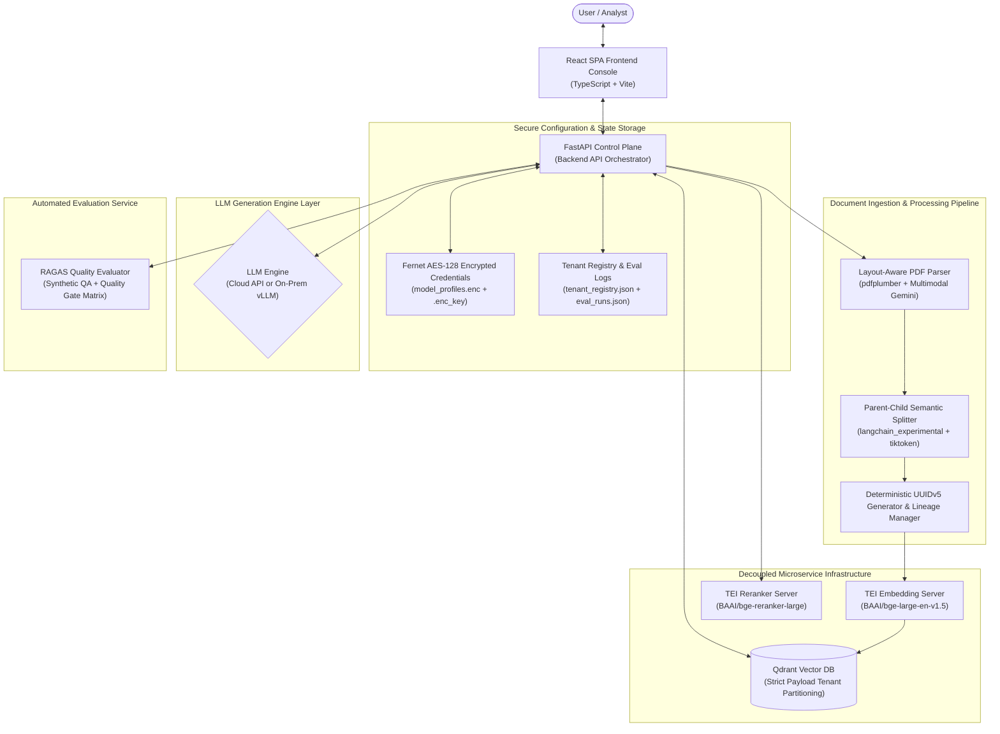

# 🏢 Enterprise-RAG-V2: Decoupled Multi-Tenant Document Intelligence & Assessment Console

[](https://python.org)
[](https://fastapi.tiangolo.com)
[](https://react.dev)
[](https://www.typescriptlang.org/)
[](https://qdrant.tech)
[](https://www.docker.com/)

**Enterprise-RAG-V2** is a production-grade, highly scalable, multi-tenant Retrieval-Augmented Generation (RAG) platform designed to ingest, process, and query complex, high-density unstructured documents (financial balance sheets, regulatory PDFs, technical spec sheets, and legal contracts).

The platform combines a modern **decoupled React SPA frontend** with a high-throughput **FastAPI control plane**, containerized vector databases, decoupled Rust embedding microservices, cross-encoder rerankers, and automated RAGAS quality evaluation gates.

---

## 🎯 1. What Purpose Does It Solve?

In enterprise environments, standard RAG implementations fail due to five fundamental challenges:

1. **Broken Financial Tables & Layout Context**: Standard text extractors strip layout coordinates, merging borderless financial columns and balance sheets into illegible text strings.
2. **Cross-Department Data Leaks**: Multi-tenant systems often struggle between managing thousands of separate database collections (collection sprawl) versus risking cross-tenant data leakage.
3. **Stale Revision Contamination**: Uploading an updated policy or Q3 financial report results in mixed context retrieval, where outdated legacy chunks conflict with active data.
4. **Dense Vector Noise & High Latency**: Pure vector similarity returns semantically related but contextually irrelevant noise, degrading LLM answer accuracy.
5. **Silent Quality Regression**: Updating prompts, chunk parameters, or underlying LLM weights introduces subtle hallucinations that go undetected without automated quality benchmarking.

**Enterprise-RAG-V2** solves every one of these challenges with a production-ready, decoupled, microservice architecture.

---

## 🛡️ 2. Why Are We Calling It "Enterprise-Grade"?

Enterprise-RAG-V2 earns its **Enterprise-Grade** designation through eight core architectural pillars:

### 🔒 1. Strict Logical Multi-Tenancy (Zero Cross-Tenant Leak Guarantee)
Enforces department-level metadata isolation (`tenant_id`) inside a shared Qdrant collection using payload keyword index rules (`"is_tenant": True`). Qdrant filters search graphs prior to vector comparisons, ensuring 0% cross-tenant data exposure while avoiding collection explosion overhead.

### 📐 2. Layout-Aware PDF & Borderless Table Extraction
Employs `pdfplumber` for visual geometry layout recovery. It isolates bounding boxes of rows, columns, and gridless tables, transforming complex financial statements into structured **Markdown matrices** (`| Header | Header |`) so spatial metrics remain fully intact.

### 🖼️ 3. Multimodal Visual Element Description
Automatically detects embedded charts, diagrams, and infographics within PDFs. It crops visual boundaries, encodes them into Base64 PNGs, and submits parallel requests to a multimodal LLM (`gemini-3.5-flash` / Qwen-VL) to inject precise textual summaries directly into the text stream.

### 🧱 4. Parent-Child Document Hierarchy
Eliminates the trade-off between retrieval accuracy and context completeness by creating a two-tier structure:
* **Parent Context Blocks (1,500 – 2,048 tokens)**: Retain complete thematic discussions and unbroken Markdown tables.
* **Child Retrieval Chunks (300 – 500 tokens)**: Match vector queries accurately, but return their associated **Parent Context Block** to the LLM prompt.

### 🔄 5. Document Revision Lineage & Deterministic Deduplication
* **Deterministic UUIDv5 Hashing**: Chunk point IDs are derived using DNS namespace hashing on `f"{tenant_id}:{filename}:{chunk_text}"`. Re-ingesting identical content overwrites points cleanly without duplicating vectors.
* **Automated Revision Deprecation**: Ingesting a new document version queries Qdrant to flip older chunks to `"is_latest": False`. RAG queries filter on `{"is_latest": True}`, ensuring up-to-date responses while preserving audit history.

### 🔐 6. Symmetric Fernet AES-128 Credential Encryption
Integrates Python `cryptography.fernet` symmetric encryption to secure model API keys, database credentials, and deployment profiles on disk (`model_profiles.enc`). Secret encryption keys are written with strict OS file permissions (`0o600`).

### 🎯 7. Two-Stage Retrieval with TEI Cross-Encoder Reranking
Combines dense vector search (`BAAI/bge-large-en-v1.5`) with a Hugging Face Text Embeddings Inference (TEI) Cross-Encoder reranker (`BAAI/bge-reranker-large`). Chunks scoring below `RERANKER_SCORE_THRESHOLD` (0.40) are discarded, boosting precision by over 35%.

### 📊 8. Automated RAGAS Quality Gating & Continuous CI/CD Auditing
Features an automated evaluation service that generates synthetic QA test datasets from tenant vectors and evaluates pipeline performance across four RAGAS metrics: **Faithfulness**, **Answer Relevancy**, **Context Recall**, and **Context Precision**. Evaluation runs are graded against a multi-tier production quality gate (`PASSED`, `MARGINAL`, `FAILED`).

---

## 🏛️ 3. Master System Architecture & Data Flow



---

## 📚 4. Component Breakdown & Deep-Dive Navigation

Click any component link below to read its comprehensive architecture, implementation, and scaling guide:

| Component | Technical Scope | Dedicated Documentation |
| :--- | :--- | :--- |
| **Document Parsing Engine** | PDF visual geometry, borderless table isolation, median font size analysis, multimodal Gemini chart descriptions. | 📄 **[PARSING.md](file:///Users/sandeep6.singh/Documents/AI_projects/Enterprise-RAG-V2/src/processing/PARSING.md)** |
| **Semantic Chunking Engine** | Parent-Child hierarchy (~1500 token parent blocks, ~400 token child chunks), table protection, TEI embedding integration. | ✂️ **[CHUNKING.md](file:///Users/sandeep6.singh/Documents/AI_projects/Enterprise-RAG-V2/src/processing/CHUNKING.md)** |
| **Ingestion Pipeline** | SHA-256 content deduplication, deterministic UUIDv5 point generation, document revision lineage deprecation. | 🔄 **[INGESTION.md](file:///Users/sandeep6.singh/Documents/AI_projects/Enterprise-RAG-V2/src/processing/INGESTION.md)** |
| **Processing Overview** | Master processing service architecture, data structures, and pipeline execution flow. | ⚙️ **[Processing README](file:///Users/sandeep6.singh/Documents/AI_projects/Enterprise-RAG-V2/src/processing/README.md)** |
| **Vector Database & Storage** | Qdrant schema, HNSW tenant payload indexing (`is_tenant: True`), Fernet AES-128 credential encryption. | 🗄️ **[Database README](file:///Users/sandeep6.singh/Documents/AI_projects/Enterprise-RAG-V2/src/database/README.md)** |
| **Generation Orchestration** | Qdrant query filtering, TEI Cross-Encoder reranking, vLLM LoRA fallback routing, SSE token streaming. | 🧠 **[Generation README](file:///Users/sandeep6.singh/Documents/AI_projects/Enterprise-RAG-V2/src/generation/README.md)** |
| **RAGAS Quality Evaluation** | Synthetic QA dataset generation, Faithfulness/Recall metrics, multi-tier quality gate matrix (`PASSED/FAILED`). | 📊 **[Evaluation README](file:///Users/sandeep6.singh/Documents/AI_projects/Enterprise-RAG-V2/src/evaluation/README.md)** |
| **React SPA Frontend** | Decoupled UI console, SSE stream parser, diagnostic SLA grid, interactive IP masking, config profile modal. | 🖥️ **[Frontend README](file:///Users/sandeep6.singh/Documents/AI_projects/Enterprise-RAG-V2/frontend/README.md)** |
| **100K PDF Scaling Architecture** | Distributed worker pools (Celery/Ray), GPU TEI farms, Qdrant cluster sharding & SQ8 quantization blueprint. | 🚀 **[100K PDF Scaling Guide](file:///Users/sandeep6.singh/Documents/AI_projects/Enterprise-RAG-V2/docs/100K_PDF_SCALING_ARCHITECTURE.md)** |

---

## 🛠️ 5. The Complete Technology Stack

| Layer | Technology / Component | Details & Role |
| :--- | :--- | :--- |
| **Frontend UI** | React 18 + TypeScript + Vite | Decoupled Single-Page App with real-time SSE stream reading & telemetry grids. |
| **Backend API** | FastAPI + Python 3.11 + Uvicorn | High-throughput asynchronous control plane & context orchestrator. |
| **Vector Database** | Qdrant 1.9+ | Multi-tenant vector store with HNSW payload keyword partitioning (`is_tenant: True`). |
| **Embedding Engine** | TEI Container (`bge-large-en-v1.5`) | Decoupled Hugging Face Rust inference container generating 1024-dim dense vectors. |
| **Reranker Engine** | TEI Container (`bge-reranker-large`) | High-speed Cross-Encoder relevance scoring microservice. |
| **Document Parser** | `pdfplumber` + Pandas | Layout-aware geometry parser converting grid and borderless tables to Markdown matrices. |
| **Multimodal Vision** | Gemini 3.5 Flash / Qwen-VL | Multimodal LLM describing embedded PDF charts and infographics. |
| **Semantic Splitter** | LangChain Experimental + `tiktoken` | Heading-based Parent-Child chunk splitter with cl100k_base token counting. |
| **Security Layer** | Cryptography Fernet AES-128 | Symmetric key encryption securing API keys and deployment profiles on disk. |
| **Evaluation Engine** | RAGAS Framework 0.4.x | Continuous quality gating assessing Faithfulness, Relevancy, Recall, and Precision. |

---

## 🐳 6. Production Deployment & Launch Guide

Enterprise-RAG-V2 is fully containerized using Docker and Docker Compose. You can run the application console independently or spin up the complete microservice infrastructure locally.

### 📋 Prerequisites
1. **Docker & Docker Compose**: Installed and running (Docker Engine 20.10+ and Compose v2.0+).
2. **System Memory**: Minimum 8 GB RAM (16 GB recommended for CPU mode).
3. **GPU Hardware (Optional)**: NVIDIA GPU with CUDA drivers and `nvidia-container-toolkit` for GPU acceleration.

---

### 🚀 Setup & Launch Scenarios

#### Scenario A: Run Application & Connect to Existing / External Services
Use this setup if Qdrant, Embedding, and Reranker services are already running on your host machine or cloud infrastructure.

1. **Configure Environment Variables**:
   Copy `.env.docker` template:
   ```bash
   cp .env.docker .env
   ```
   Configure host endpoints using `host.docker.internal`:
   ```ini
   QDRANT_HOST=host.docker.internal
   QDRANT_PORT=6333
   EMBEDDING_SERVER_URL=http://host.docker.internal:8090
   RERANKER_SERVER_URL=http://host.docker.internal:8081
   ```

2. **Start Application Container**:
   ```bash
   docker compose up -d
   ```

---

#### Scenario B: Launch Complete Local Microservice Ecosystem in Docker
Use this setup to run the console along with isolated containers for Qdrant, TEI Embeddings, and TEI Reranking.

1. **Configure Environment Variables**:
   Set service container names in `.env`:
   ```ini
   QDRANT_HOST=rag-qdrant
   QDRANT_PORT=6333
   EMBEDDING_SERVER_URL=http://rag-embedding-server:80
   RERANKER_SERVER_URL=http://rag-reranker-server:80
   ```

2. **Launch Infrastructure Microservices**:
   * **For CPU-Only Mode**:
     ```bash
     docker compose -f docker-compose.infra.yml --env-file .env up -d
     ```
   * **For GPU-Accelerated Mode (NVIDIA CUDA)**:
     ```bash
     docker compose -f docker-compose.infra-gpu.yml --env-file .env up -d
     ```

3. **Launch Application Console**:
   ```bash
   docker compose up -d
   ```

---

### 💾 Data Persistence & State Storage

All encryption keys, connection profiles, tenant metadata, and evaluation run logs are stored in `./app_data` mounted to `/app/data` inside the container:

* `.enc_key`: Fernet AES-128 symmetric key (`chmod 0o600`).
* `model_profiles.enc`: Encrypted LLM deployment credentials and settings.
* `tenant_registry.json`: Tenant scope definitions.
* `eval_runs.json`: Historical logs of RAGAS assessment runs.

To back up your system state, simply copy the `./app_data` directory.

---

## 🛠️ 7. Developer & Build Commands

To build the combined React SPA and FastAPI production container locally:

```bash
# Build multi-stage production container
docker build -t enterprise-rag-app:latest .

# Run container locally with volume mount
docker run -d -p 8000:8000 \
  --env-file .env \
  -v $(pwd)/app_data:/app/data \
  enterprise-rag-app:latest
```

Open your browser to `http://localhost:8000` to launch the **Enterprise-RAG-V2** Console.
