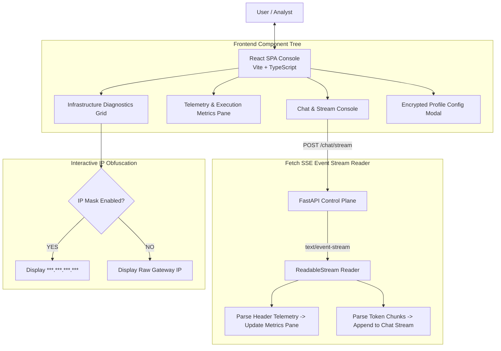
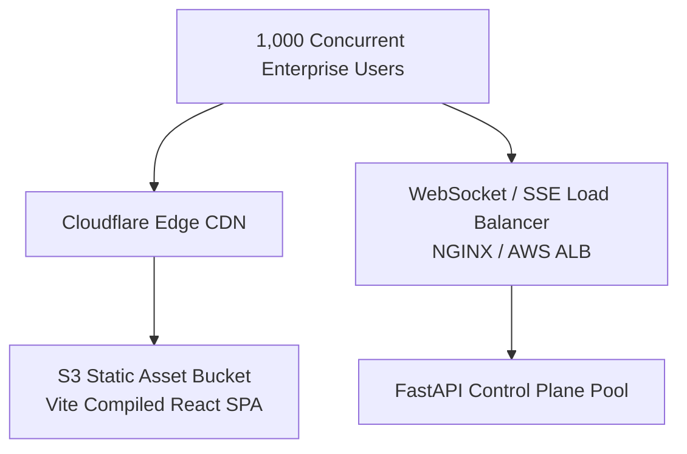

# 🖥️ Enterprise-RAG-V2 Decoupled Console Frontend (`frontend/`)

[← Back to main README](../README.md)

A high-performance single-page web console (React 18 + TypeScript + Vite) providing real-time Server-Sent Events (SSE) chat token streaming, timing telemetry, infrastructure SLA diagnostic grids, dynamic IP masking, profile configuration management, and RAGAS quality evaluation dashboards.

---

## 📁 Directory Structure & File Mapping

```
frontend/
├── src/
│   ├── components/       # UI components (ChatConsole, TelemetryGrid, ConfigModal, Diagnostics)
│   ├── App.tsx           # Main application console view
│   ├── main.tsx          # React application entrypoint
│   └── index.css         # Styling system & dark theme tokens
├── package.json          # Node dependencies (Vite, React, Lucide Icons)
├── vite.config.ts        # Vite dev server & proxy settings
└── README.md             # Frontend Console Documentation
```

---

## 📌 1. What & Why?

### What it Does
* **Real-Time Token Streaming**: Uses native browser Fetch Stream Readers to consume Server-Sent Events (`text/event-stream`) for zero-lag token rendering.
* **Latency & SLA Telemetry Split-Pane**: Displays granular execution metrics for every query:
  * **Time-to-First-Token (TTFT)**
  * **Embedding Duration**
  * **Qdrant Vector Search Duration**
  * **TEI Reranker Duration**
  * **Generation Rate (Tokens/sec)**
* **Infrastructure Telemetry & SLA Warning Grid**: Executes one-click system health checks against active endpoints (Qdrant, TEI Embedder, TEI Reranker, LLM provider). Latencies exceeding SLA thresholds are flagged in amber/red.
* **Interactive IP Address Masking**: Automatically obfuscates backend IP addresses (`***.***.***.***`) in public UI cards, with click-to-reveal toggles to protect sensitive infra topologies during screenshots.
* **Dynamic Environment Configuration Modal**: Interfaces with the backend Fernet encryption storage to manage active deployment profiles without server restarts.

### Why We Built It This Way
Enterprise AI consoles must deliver both fast user UX and operational transparency:
1. **Decoupled Architecture**: Hosting the SPA independently allows edge CDN distribution and isolates client UI rendering from heavy backend python ingestion worker nodes.
2. **Telemetry Visibility**: Analysts need to understand why a query was slow. Split-pane telemetry isolates latency down to specific microservices (e.g. identifying if delay was in vector search vs reranking vs LLM generation).

---

## 🏛️ 2. Architectural Structure & SSE Stream Processing



---

## 🔍 3. How It Works: Technical Deep-Dive

### A. Fetch Stream Reader Implementation
```typescript
const response = await fetch('/api/chat/stream', {
  method: 'POST',
  headers: { 'Content-Type': 'application/json' },
  body: JSON.stringify({ query, tenant_id: activeTenant })
});

const reader = response.body?.getReader();
const decoder = new TextDecoder();

while (true) {
  const { done, value } = await reader.read();
  if (done) break;
  const chunk = decoder.decode(value);
  // Parse data: {"type": "token", "content": "..."}
}
```

### B. Diagnostics SLA Warning SLA Thresholds
* **Qdrant Search SLA**: Warning if latency > `100ms`.
* **TEI Reranker SLA**: Warning if latency > `300ms`.
* **TTFT SLA**: Warning if Time-to-First-Token > `500ms`.

---

## ⚡ 4. How to Scale Frontend for 100,000 PDFs / Enterprise Users



### Key Scaling Interventions:
1. **Edge CDN Distribution**: Compile Vite assets (`npm run build`) and serve `dist/` via Cloudflare or Amazon CloudFront for sub-20ms page load times worldwide.
2. **Virtualized Chat History**: Use `@tanstack/react-virtual` to render large chat logs containing thousands of tokens with zero DOM lag.
