# 🗄️ Database, Vector Storage & Security Module (`src/database/`)

[← Back to main README](../../README.md) | [🔍 Hybrid Search Documentation](../../HYBRID_SEARCH.md)

The **Database & Storage Module** manages high-performance vector persistence, logical multi-tenant partitioning in Qdrant, True Hybrid Search Fusion (Dense + Sparse BM25 via Reciprocal Rank Fusion), Redis multi-turn session memory, security audit trails, and symmetric AES-128 credential encryption.

---

## 📁 Directory Structure & File Mapping

```
src/database/
├── qdrant_ops.py            # Qdrant schema initialization (Dense 1024-dim + Sparse BM25) & HNSW indexing
├── query_engine.py          # True Hybrid Search Fusion (RRF Query Engine) & Cross-Encoder score uniformity
├── conversation_memory.py   # Redis-backed multi-turn session memory manager
├── audit_vault.py           # Administrative & security audit log recorder
├── retention_manager.py     # Dynamic log retention policy & SQL purge manager
├── secure_storage.py        # Cryptography Fernet AES-128 key encryption & tenant registry state
└── README.md                # Database & Storage Module Documentation
```

---

## 📌 1. What & Why?

### What it Does
* **True Hybrid Search Fusion**: Configures Qdrant with dual named vectors (`"dense"` COSINE 1024-dim and `"sparse"` BM25 via FastEmbed) and executes `query_points` with parallel prefetch and `FusionQuery(fusion=Fusion.RRF)`.
* **Logical Multi-Tenancy**: Houses vector embeddings for multiple enterprise departments in a single Qdrant collection while guaranteeing strict data isolation via `tenant_id` payload index (`"is_tenant": True`).
* **Multi-Turn Conversation Memory**: Stores turn history in Redis (`RedisConversationMemoryManager`), serving active session turns to the query reformulation engine.
* **Security Audit Vault**: Records immutable audit events (config updates, login attempts, log purges) in SQLite (`audit_logs` table).
* **Symmetric AES-128 Encryption**: Encrypts model API keys, database URLs, and deployment profiles in `model_profiles.enc` using `cryptography.fernet`.

---

## 🏛️ 2. Architectural Data Flow & Security Model

```mermaid
flowchart TD
    subgraph Storage_Security ["1. AES-128 Encrypted Credentials Layer"]
        KeyFile[".enc_key (Fernet Key - chmod 0o600)"] --> FernetEngine[Cryptography Fernet Engine]
        EncFile["model_profiles.enc (Encrypted JSON)"] <--> FernetEngine
        FernetEngine <--> MemoryConfig[Decrypted Active Environment Config]
    end

    subgraph Qdrant_Indexing ["2. Schema & Dual Vector Partitioning"]
        QdrantInit[QdrantManager.initialize_collection] --> CreateColl[Create Collection: enterprise_rag_v2]
        CreateColl --> DenseConfig["Dense Vector: size=1024, Distance=Cosine"]
        CreateColl --> SparseConfig["Sparse Vector: BM25 (FastEmbed)"]
        CreateColl --> PayloadIndex["create_payload_index: tenant_id (keyword, is_tenant=True)"]
    end

    subgraph Query_Execution ["3. Hybrid RRF Retrieval Execution"]
        QueryReq[Query Request + Tenant ID] --> QueryEng[MultiTenantQueryEngine]
        QueryEng --> PrefetchDense["Prefetch 1: Dense Vector Search"]
        QueryEng --> PrefetchSparse["Prefetch 2: Sparse BM25 Search"]
        PrefetchDense --> RRF["Qdrant FusionQuery (RRF)"]
        PrefetchSparse --> RRF
        RRF --> Rerank[Cross-Encoder Reranker]
    end
```



---

## 🔍 3. Key Components Technical Deep-Dive

### A. Dual Named Vector Schema (`qdrant_ops.py`)
```python
vectors_config = {"dense": models.VectorParams(size=1024, distance=models.Distance.COSINE)}
sparse_vectors_config = {"sparse": models.SparseVectorParams(index=models.SparseIndexParams(on_disk=False))}

client.create_collection(
    collection_name=collection_name,
    vectors_config=vectors_config,
    sparse_vectors_config=sparse_vectors_config
)
```

### B. Reciprocal Rank Fusion Query Execution (`query_engine.py`)
```python
# Construct parallel prefetches
prefetch_dense = models.Prefetch(query=dense_vec, using="dense", limit=limit * 2, filter=query_filter)
prefetch_sparse = models.Prefetch(query=sparse_vec, using="sparse", limit=limit * 2, filter=query_filter)

# Execute RRF Fusion Query
res = client.query_points(
    collection_name=collection_name,
    prefetch=[prefetch_dense, prefetch_sparse],
    query=models.FusionQuery(fusion=models.Fusion.RRF),
    limit=limit
)
```

### C. Multi-Turn Session Memory (`conversation_memory.py`)
```python
class RedisConversationMemoryManager:
    def add_turn(self, session_id: str, user_query: str, assistant_response: str):
        # Appends user & assistant turns to Redis list with automatic TTL expiration
```
