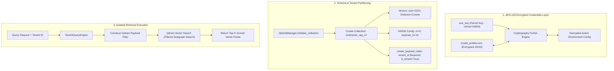
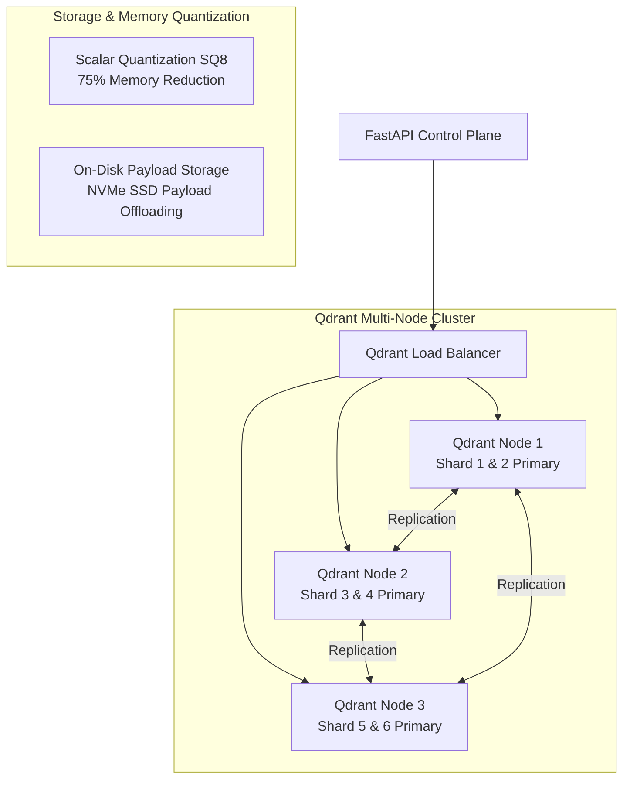

# 🗄️ Database, Vector Storage & Encryption Engine (`src/database/`)

[← Back to main README](../../README.md)

The **Database & Storage Module** manages high-performance vector persistence, logical multi-tenant partitioning in Qdrant, query payload filtering, and symmetric AES-128 credential encryption.

---

## 📁 Directory Structure & File Mapping

```
src/database/
├── qdrant_ops.py       # Qdrant collection schema initialization & HNSW tenant payload indexing
├── query_engine.py     # Tenant-scoped vector query construction & Qdrant search execution
├── secure_storage.py   # Cryptography Fernet AES-128 key encryption & tenant registry state
└── README.md           # Database & Storage Module Documentation
```

---

## 📌 1. What & Why?

### What it Does
* **Logical Multi-Tenancy**: Houses vector embeddings for multiple enterprise departments (e.g. Finance, HR, Legal) in a single Qdrant collection while guaranteeing strict data isolation.
* **HNSW Payload Indexing**: Maps `tenant_id` as an indexed payload keyword (`"is_tenant": True`), allowing Qdrant to filter search spaces directly inside the HNSW graph prior to vector comparison.
* **Symmetric AES-128 Encryption**: Uses Python `cryptography.fernet` to encrypt model API keys, database URLs, and deployment profiles in `model_profiles.enc` with file system permissions restricted to `0o600`.
* **Tenant Scoped Vector Querying**: Intercepts vector queries to automatically append strict metadata filters:
  ```json
  {
    "must": [
      {"key": "tenant_id", "match": {"value": "finance_reasoning"}},
      {"key": "is_latest", "match": {"value": true}}
    ]
  }
  ```

### Why We Built It This Way
1. **Multi-Tenancy without Collection Explosion**:
   Creating separate database collections for every enterprise tenant leads to severe resource exhaustion (each Qdrant collection allocates dedicated HNSW memory buffers and file handles). Payload-level tenant indexing achieves strict isolation within a **single collection** with zero administrative overhead.
2. **Credential Security at Rest**:
   Enterprise deployments cannot risk storing raw API tokens or database credentials in unencrypted JSON or environment files. Fernet AES-128 encryption guarantees credentials remain secure on disk even if container volume snapshots are exposed.

---

## 🏛️ 2. Architectural Data Flow & Security Model



---

## 🔍 3. How It Works: Technical Deep-Dive

### A. Qdrant Schema & HNSW Tenant Payload Indexing (`qdrant_ops.py`)
```python
# Create collection with optimized HNSW payload routing
payload = {
    "vectors": {"size": 1024, "distance": "Cosine"},
    "hnsw_config": {"m": 0, "payload_m": 16}
}

# Apply tenant keyword schema
self.client.create_payload_index(
    collection_name=Config.COLLECTION_NAME,
    field_name="tenant_id",
    field_schema={"type": "keyword", "is_tenant": True}
)
```
Setting `is_tenant: True` instructs Qdrant to construct dedicated tenant sub-graphs inside the HNSW index structure. During search, non-matching tenant nodes are discarded instantly without vector distance calculations.

### B. Encrypted Credential Manager (`secure_storage.py`)
```python
class SecureStorageManager:
    @staticmethod
    def _get_or_create_key() -> bytes:
        if os.path.exists(KEY_FILE):
            with open(KEY_FILE, "rb") as f:
                return f.read()
        else:
            key = Fernet.generate_key()
            with open(KEY_FILE, "wb") as f:
                f.write(key)
            os.chmod(KEY_FILE, 0o600)  # Owner read/write only
            return key
```

---

## ⚡ 4. How to Scale Vector Database to 100,000 PDFs

Storing **15,000,000 vectors** (150 GB footprint) requires an enterprise Qdrant cluster topology:



### Key Scaling Interventions:
1. **Scalar Quantization (SQ8)**:
   * Converts 32-bit floating point vectors (FP32) to 8-bit integers (INT8).
   * Reduces RAM requirements from **61.4 GB down to ~15.3 GB** with < 1% recall loss.
2. **On-Disk Payload Storage (`on_disk_payload: true`)**:
   * Keeps HNSW vector graphs in RAM for rapid search, while streaming raw Markdown payload text directly from NVMe SSDs upon hit retrieval.
3. **Multi-Node Sharding & Replication**:
   * Configure 6 shards with replication factor 2 across 3 nodes for zero-downtime high availability and concurrent search throughput (**1,000+ queries/sec**).
