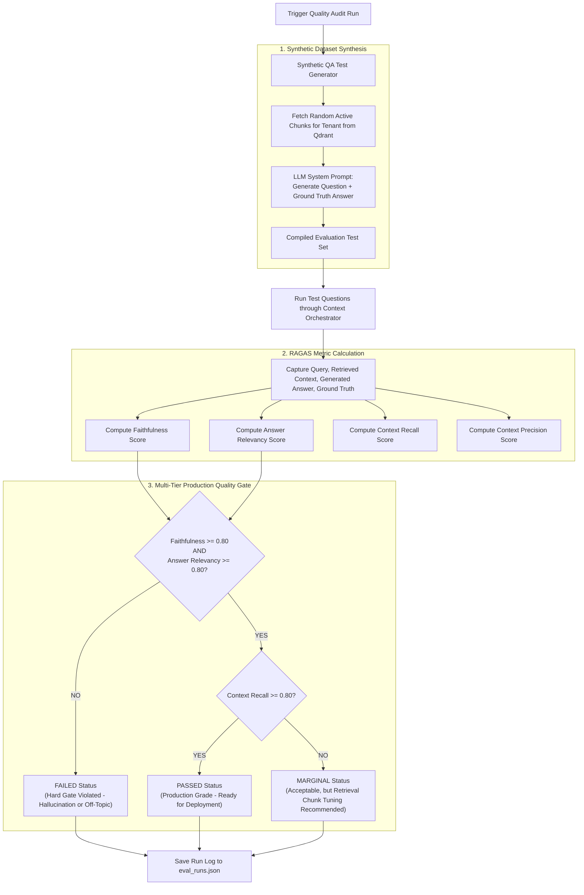
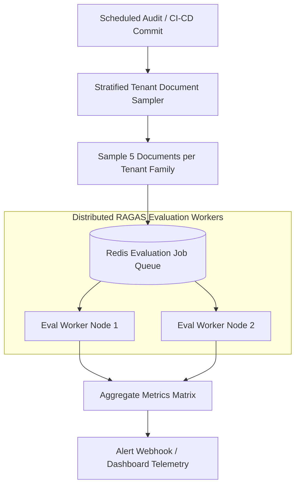

# 📊 RAGAS Quality Evaluation & Gating Engine (`src/evaluation/`)

The **Evaluation & Quality Gating Module** (`rag_evaluator.py`) provides automated testing, synthetic test dataset generation, and multi-tier quality gate validation for **Enterprise-RAG-V2** using the **RAGAS (Retrieval Augmented Generation Assessment)** framework.

---

## 📁 Directory Structure & File Mapping

```
src/evaluation/
├── rag_evaluator.py   # RAGAS framework wrapper, synthetic QA generator & quality gate engine
└── README.md          # Evaluation Service Documentation
```

---

## 📌 1. What & Why?

### What it Does
* **Synthetic QA Dataset Generator**: Automatically pulls active document vectors for a tenant from Qdrant, prompts an LLM to formulate realistic enterprise questions and ground-truth answers, and compiles validation datasets.
* **RAGAS Metric Assessment**: Evaluates RAG pipeline executions across four core mathematical dimensions:
  1. **Faithfulness** (Answer Grounding): Verifies that generated claims originate exclusively from retrieved context (detects hallucinations).
  2. **Answer Relevancy**: Verifies that the answer directly addresses the query without evasive fluff.
  3. **Context Recall**: Verifies that retrieved passages contain all information needed to reconstruct the ground-truth answer.
  4. **Context Precision**: Verifies that the most relevant context passages are ranked at the top of the search result set.
* **Weighted Production Quality Gate**: Evaluates scores against a multi-tier gate matrix to assign run statuses: `PASSED`, `MARGINAL`, or `FAILED`.
* **Historical Audit Logging**: Persists evaluation metrics and run history to `eval_runs.json`.

### Why We Built It This Way
RAG applications are vulnerable to silent quality degradation:
* Changing an embedding model or chunk size might improve query speed but secretly cause hallucinations in financial reporting.
* Manual human spot-checking is slow, expensive, and unscalable for 100,000 PDFs.

Automated **RAGAS Quality Gating** acts as a CI/CD build break system for document intelligence: code or prompt changes that drop Faithfulness below `0.80` are rejected automatically!

---

## 🏛️ 2. Architectural Data Flow & Quality Gate Logic



---

## 🔍 3. How It Works: Technical Deep-Dive

### A. The Multi-Tier Quality Gate Matrix
The evaluator enforces three distinct production tiers:

| Status Tag | Criteria | Meaning / Action Required |
| :--- | :--- | :--- |
| **`FAILED`** | Faithfulness < 0.80 **OR** Relevancy < 0.80 | **Hard Failure**: System is hallucinating facts or failing to answer user questions. Deployment blocked. |
| **`PASSED`** | Faithfulness ≥ 0.80 **AND** Relevancy ≥ 0.80 **AND** Context Recall ≥ 0.80 | **Production Ready**: High precision, accurate context retrieval, zero hallucination. |
| **`MARGINAL`**| Faithfulness ≥ 0.80 **AND** Relevancy ≥ 0.80 **BUT** Context Recall < 0.80 | **Warning**: Generated answers are accurate, but retriever missed minor supporting documents. Chunk tuning suggested. |

---

## ⚡ 4. How to Scale Evaluation to 100,000 PDFs

Evaluating a knowledge base of **100,000 PDFs** requires intelligent sampling and automated regression pipelines:



### Key Scaling Interventions:
1. **Stratified Family Sampling**:
   * Instead of evaluating 15 million chunks, sample 5 representative documents from each tenant's active document families.
2. **Asynchronous Batch Evaluation Workers**:
   * Run evaluation execution jobs asynchronously over Redis Celery queues during off-peak hours.
3. **CI/CD Quality Regression Gating**:
   * Connect evaluation runs to GitHub Actions or GitLab CI. If a pull request causes the synthetic test benchmark score to drop below 0.80, the pull request merge is blocked automatically.
