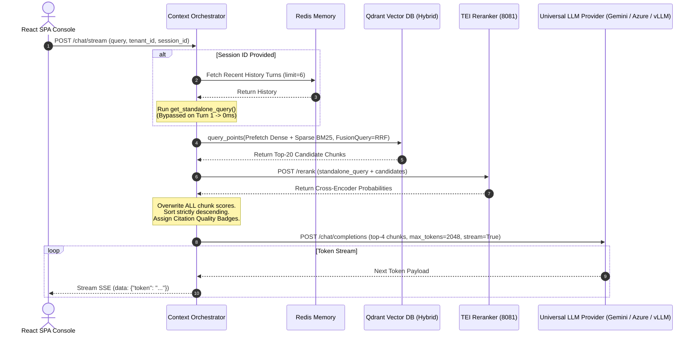

# 🧠 Generation, Retrieval & LLM Orchestration Service (`src/generation/`)

[← Back to main README](../../README.md) | [🔍 Hybrid Search Documentation](../../HYBRID_SEARCH.md)

The **Generation & Retrieval Module** (`orchestrator.py`) is the central intelligence engine of **Enterprise-AI-Fabric**. It orchestrates True Hybrid Search Fusion, Standalone Query Reformulation (topic isolation), TEI Cross-Encoder reranking & score uniformity, Azure OpenAI / Google Gemini / vLLM endpoint building, sub-20ms latency optimizations, thinking model headroom protection, and Server-Sent Events (SSE) token streaming.

---

## 📁 Directory Structure & File Mapping

```
src/generation/
├── orchestrator.py    # Master Context Orchestrator, Query Reformulator & SSE Streaming Generator
└── README.md          # Generation Service Documentation
```

---

## 📌 1. What & Why?

### What it Does
* **Multi-Turn Topic Isolation (`get_standalone_query`)**: Converts chat history + user query into a standalone query. Automatically **drops prior topic keywords** when a user switches topics (e.g. from medical claims to car lease).
* **Turn 1 Latency Bypass**: Skips the query rewriter on Turn 1 when `chat_history` is empty, dropping pre-processing latency down to **0.00ms**.
* **Cross-Encoder Score Uniformity & Quality Badging**: Overwrites the `score` field of **every single candidate chunk** with its BGE Cross-Encoder score, sorts candidate chunks strictly descending, and assigns UI Citation Quality Badges (`HIGH_CONFIDENCE`, `MEDIUM_CONFIDENCE`, `LOW_CONFIDENCE`, `UNVERIFIED`).
* **Universal Multi-Cloud LLM Endpoint Builder (`_build_llm_endpoint_and_headers`)**: Native REST support for **Google Gemini** (`https://generativelanguage.googleapis.com/v1beta/openai`), **Azure OpenAI** (with `api-key` header and `api-version` query params), **OpenAI Cloud API**, **vLLM**, and **Ollama**.
* **Thinking & Reasoning Model Protection**: Enforces a minimum token floor of **2,048 tokens** (`DEFAULT_MAX_TOKENS = 2048`) so reasoning models (Gemini 3.5 Flash, DeepSeek R1) have sufficient token budget for internal reasoning traces and complete, un-truncated answers.
* **Fail-Safe Non-RAG Direct Chat (`chat_tenant`)**: Uses an unconstrained general AI assistant system prompt for direct model testing without requiring Qdrant collection registration.

---

## 🏛️ 2. Architectural Query Flow & Sequence Diagram



---

## 🔍 3. Key Components Technical Deep-Dive

### A. Turn 1 Fast Bypass & Query Reformulation (`get_standalone_query`)
```python
def get_standalone_query(self, user_query: str, chat_history: List[Dict[str, str]], llm_overrides: Dict[str, Any] = None) -> str:
    # Fast Bypass on Turn 1 (0ms latency cost)
    if not chat_history or len(chat_history) == 0:
        return user_query.strip()

    # Fast Rewriter LLM parameters (Turn 2+)
    vllm_payload = {
        "model": default_model,
        "messages": [{"role": "user", "content": reformulation_prompt}],
        "temperature": 0.0,
        "max_tokens": 30,
        "stop": ["\n", "User:", "Question:", "STANDALONE SEARCH QUERY:"]
    }
```

### B. Universal Multi-Cloud Endpoint Builder (`_build_llm_endpoint_and_headers`)
```python
def _build_llm_endpoint_and_headers(self, api_base_url: str, api_key: str, provider_type: str) -> tuple:
    base_url = (api_base_url or "").strip().rstrip('/')
    p_type = (provider_type or "").lower()
    
    if "/chat/completions" in base_url:
        vllm_endpoint = base_url
    elif "openai.azure.com" in base_url or "azure" in p_type:
        if "api-version" not in base_url:
            vllm_endpoint = f"{base_url}/chat/completions?api-version=2024-02-15-preview"
        else:
            vllm_endpoint = f"{base_url}/chat/completions"
    else:
        if ("ollama" in p_type or "openai" in p_type or "vllm" in p_type) and not base_url.endswith("/v1") and "/v1/" not in base_url and "generativelanguage.googleapis.com" not in base_url:
            base_url = f"{base_url}/v1"
        vllm_endpoint = f"{base_url}/chat/completions"

    headers = {"Content-Type": "application/json"}
    if api_key and api_key.lower() != "none":
        headers["Authorization"] = f"Bearer {api_key}"
        headers["api-key"] = api_key  # Required for Azure OpenAI REST API authentication

    return vllm_endpoint, headers
```

### C. Thinking & Reasoning Model Headroom Protection
```python
max_out = int(overrides.get("DEFAULT_MAX_TOKENS", Config.DEFAULT_MAX_TOKENS) or 2048)
vllm_payload = {
    "model": target_model,
    "messages": messages,
    "temperature": temperature,
    "max_tokens": max_out if max_out >= 1024 else 2048
}
```
