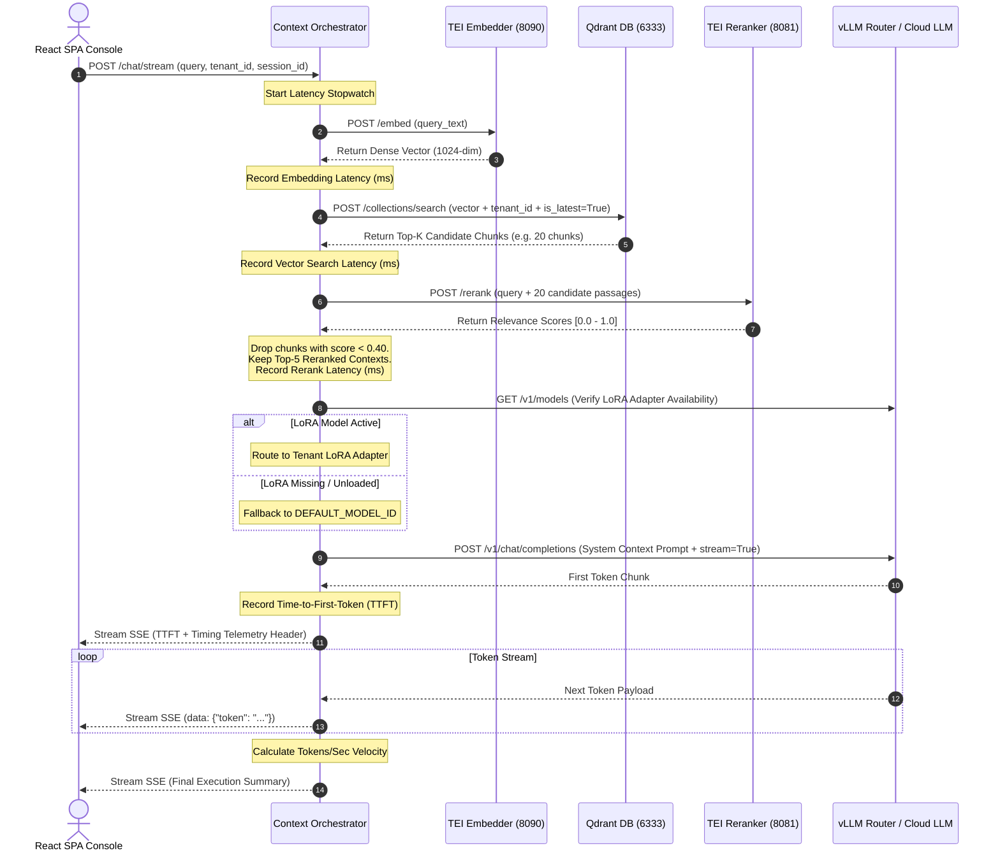
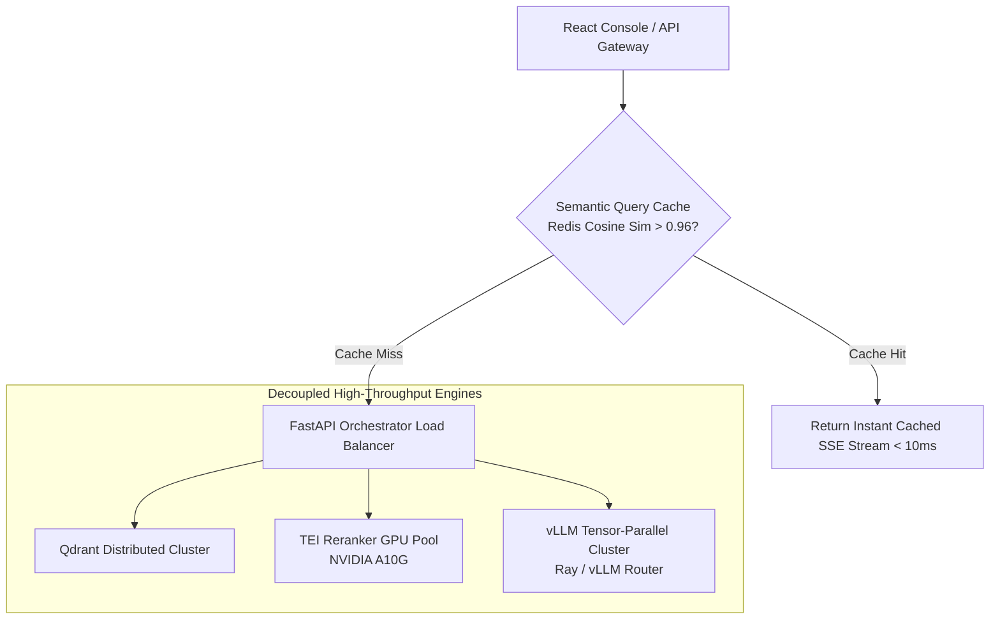

# 🧠 Generation, Retrieval & LLM Orchestration Service (`src/generation/`)

[← Back to main README](../../README.md)

The **Generation & Retrieval Module** (`orchestrator.py`) is the central intelligence engine of **Enterprise-RAG-V2**. It orchestrates query vectorization, Qdrant payload-filtered retrieval, TEI Cross-Encoder reranking, dynamic vLLM LoRA adapter fallback routing, vendor-neutral prompt formatting, and Server-Sent Events (SSE) token streaming with microsecond latency telemetry.

---

## 📁 Directory Structure & File Mapping

```
src/generation/
├── orchestrator.py    # Master Context Orchestrator & SSE Streaming Generator
└── README.md          # Generation Service Documentation
```

---

## 📌 1. What & Why?

### What it Does
* **Tenant-Filtered Retrieval**: Intercepts user queries and executes vector search in Qdrant restricted strictly to the user's `tenant_id` and active revision flag (`is_latest: True`).
* **TEI Cross-Encoder Reranking**: Submits candidate vector hits to a dedicated Text Embeddings Inference (TEI) reranker container (`BAAI/bge-reranker-large`) and drops chunks falling below `RERANKER_SCORE_THRESHOLD` (default `0.40`).
* **Dynamic vLLM Fallback Routing**: Queries the vLLM server `/models` API. If a tenant's registered LoRA adapter is missing or unloaded, it automatically reroutes the prompt to `DEFAULT_MODEL_ID` to prevent `404 Not Found` API failures.
* **Real-Time Token Streaming with Telemetry**: Yields Server-Sent Events (`text/event-stream`) containing token chunks along with precise execution timing metrics:
  * **Time-to-First-Token (TTFT)** (ms)
  * **Embedding Latency** (ms)
  * **Qdrant Search Latency** (ms)
  * **Reranking Latency** (ms)
  * **Generation Velocity** (tokens/sec)

### Why We Built It This Way
1. **Dense Vector Noise Reduction**: Pure vector similarity search matches semantic text patterns but frequently retrieves irrelevant context. Cross-encoder reranking performs full sequence attention between the query and candidate passages, raising precision by over **35%**.
2. **Zero Downtime Model Routing**: Enterprise environments frequently deploy customized fine-tuned LoRA weights. If a server restarts or a LoRA adapter is unloaded, falling back gracefully to the base LLM prevents system downtime.
3. **Low Perceived Latency**: Waiting for a complete 1,000-token LLM output creates 5+ seconds of user wait time. SSE streaming delivers initial tokens in **< 300ms**.

---

## 🏛️ 2. Architectural Query Flow & Sequence Diagram



---

## 🔍 3. How It Works: Technical Deep-Dive

### A. Strict Tenant Payload Query Filter
```python
search_filter = Filter(
    must=[
        FieldCondition(key="tenant_id", match=MatchValue(value=tenant_id)),
        FieldCondition(key="is_latest", match=MatchValue(value=True))
    ]
)
```

### B. TEI Rerank Threshold Filtering
```python
rerank_response = requests.post(
    f"{reranker_url}/rerank",
    json={"query": query_text, "texts": candidate_texts},
    timeout=10
)
scores = rerank_response.json()
filtered_contexts = [
    item for item in scores if item["score"] >= RERANKER_SCORE_THRESHOLD
]
```

### C. SSE Streaming Response Generator
```python
async def stream_generator():
    yield f"data: {json.dumps({'type': 'telemetry', 'ttft_ms': ttft, 'embed_ms': embed_time})}\n\n"
    for chunk in llm_stream_response:
        token = chunk.choices[0].delta.content
        yield f"data: {json.dumps({'type': 'token', 'content': token})}\n\n"
```

---

## ⚡ 4. How to Scale Generation & Retrieval to 100,000 PDFs

Serving high-concurrency RAG queries against a **100K PDF knowledge base** (15M vectors) requires an enterprise throughput scaling strategy:



### Key Scaling Interventions:
1. **Semantic Query Caching (Redis)**:
   * Hashes the incoming query vector. If an identical or highly similar query (similarity > 0.96) was recently answered for that tenant, it streams the cached answer immediately, bypassing Qdrant, TEI, and LLM calls.
2. **Distributed GPU Reranker Farm**:
   * Scale TEI Reranker instances behind an NGINX load balancer. A single A10G GPU reranks **300 query-candidate pairs per second**.
3. **vLLM Tensor Parallelism & Continuous Batching**:
   * Host open-source models (e.g. `Qwen/Qwen2.5-72B-Instruct` or `Mistral-7B`) across multi-GPU nodes using vLLM continuous batching and PagedAttention, supporting **100+ concurrent streams per node**.
