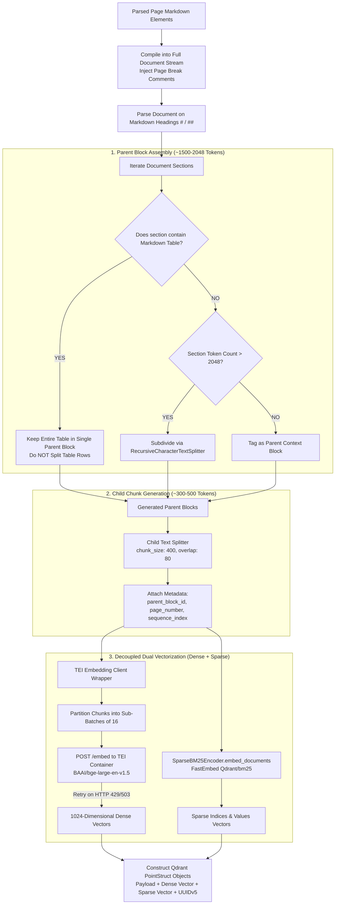
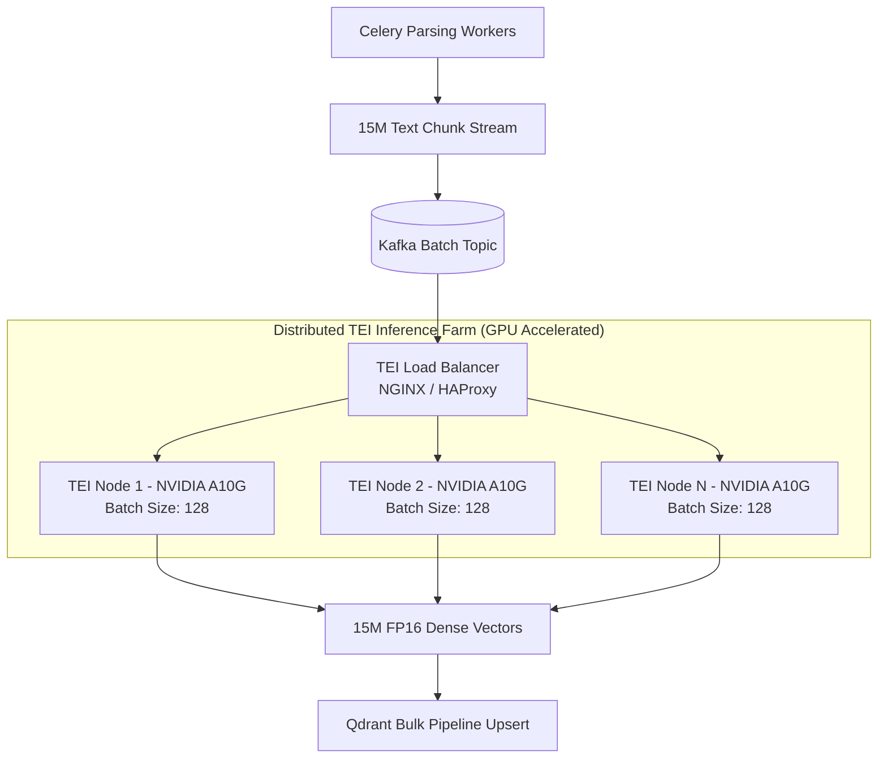

# ✂️ Semantic Chunking & Dual Vectorization Engine (`semantic_splitter.py`)

[← Back to main README](../../README.md) | [🔍 Hybrid Search Documentation](../../HYBRID_SEARCH.md)

The **Semantic Chunking Engine** converts raw extracted Markdown streams into context-preserved, hierarchy-aware text blocks (Parent & Child chunks) and vectorizes each child chunk **twice** — once as a dense embedding via a decoupled Text Embeddings Inference (TEI) server, and once as a sparse BM25 vector via FastEmbed — for downstream Hybrid Search Fusion.

---

## 📌 1. What & Why?

### What it Does
* Parses document layout structures by Markdown heading breaks (`# Heading 1`, `## Heading 2`).
* Creates a two-tier **Parent-Child Document Hierarchy**:
  * **Parent Context Blocks**: Larger context passages (1,500 – 2,048 tokens) that hold complete thematic discussions.
  * **Child Retrieval Chunks**: Smaller, focused text units (300 – 500 tokens) optimized for fine-grained dense vector similarity search.
* Enforces **Markdown Table Protection**: Ensures financial balance sheets and data tables are never fragmented across chunk boundaries.
* Computes exact token metrics using `tiktoken` (`cl100k_base` encoding).
* Dispatches text arrays to the **TEI Rust Embedding Container** (`BAAI/bge-large-en-v1.5`) in safe 16-element sub-batches with exponential retry backoff.
* Generates a matching **sparse BM25 vector** for every child chunk via `SparseBM25Encoder` (FastEmbed, `Qdrant/bm25`), so each chunk lands in Qdrant with both `dense` and `sparse` named vectors.

### Why We Built It This Way
Traditional fixed-character chunkers (e.g. splitting every 500 characters with 50 overlap) suffer from severe flaws:
1. **Context Fragmentation**: Sentences and thoughts are chopped in half, obscuring entity relationships.
2. **Table Ruin**: Splitting a table mid-row strips column headers from row values, leading to vector retrieval failures.
3. **The Size Dilemma**: Large chunks pollute vector search with noise, while small chunks lack sufficient context for the LLM to formulate an accurate answer.

The **Parent-Child Architecture** solves this: vector search matches against precise **Child Chunks**, but returns the complete **Parent Block** to the LLM context prompt!

---

## 🏛️ 2. Architectural Data Flow & Component Breakdown



---

## 🔍 3. How It Works: Technical Deep-Dive

### A. Section & Heading Parsing Logic
The engine reads the Markdown text line-by-line and creates boundaries whenever it encounters structural headers:
```python
if line.startswith(("# ", "## ")):
    if current_section_lines:
        sections.append({
            "content": "\n".join(current_section_lines).strip(),
            "page": current_page
        })
        current_section_lines = []
```
This guarantees that topics under new headings begin in fresh parent context blocks.

### B. Parent-Child Relationship Metadata Mapping
Every child chunk retains a direct pointer reference to its parent block content:
```python
child_metadata = {
    "tenant_id": tenant_id,
    "source_file": filename,
    "page_number": page,
    "parent_block_id": parent_uuid,
    "parent_block_text": parent_content,  # Complete 1500-2048 token context
    "child_text": child_content,           # Focused 300-500 token retrieval text
    "chunk_index": idx,
    "is_latest": True
}
```

### C. TEI Client Batching & Resiliency
To prevent HTTP connection timeouts or memory overflow in the Rust inference container, vectors are dispatched in strict batches of 16 items:
```python
MAX_SERVER_BATCH = 16
for i in range(0, len(texts), MAX_SERVER_BATCH):
    sub_batch = texts[i : i + MAX_SERVER_BATCH]
    # Retries up to 3 times with exponential backoff on HTTP 429, 500, 502, 503
    response = requests.post(self.api_url, json={"inputs": sub_batch}, timeout=120)
```

---

## ⚡ 4. How to Scale Chunking & Vectorization to 100,000 PDFs

Vectorizing **15,000,000 text chunks** requires a scalable embedding engine infrastructure:



### Key Scaling Interventions:
1. **GPU-Accelerated TEI Containers**:
   * Switch TEI microservices from CPU mode to **NVIDIA GPU mode** (`ghcr.io/huggingface/text-embeddings-inference:t4-1.5` or `cuda-1.5`).
   * Increase TEI server batch size from 16 to **128 or 256**.
   * Throughput jumps from **50 chunks/sec (CPU)** to **2,000 chunks/sec per A10G GPU**.
2. **Embedding Cache (Redis)**:
   * Compute MD5 hash of `child_text`.
   * Check Redis cache prior to calling TEI. If an identical paragraph was previously embedded (e.g. standard disclaimers, repeated legal headers), return cached vector in **< 1ms**.
3. **Asynchronous Vector Dispatch**:
   * Use `aiohttp` or `httpx` async event loops to pipeline embedding HTTP POSTs, eliminating thread blocking.
