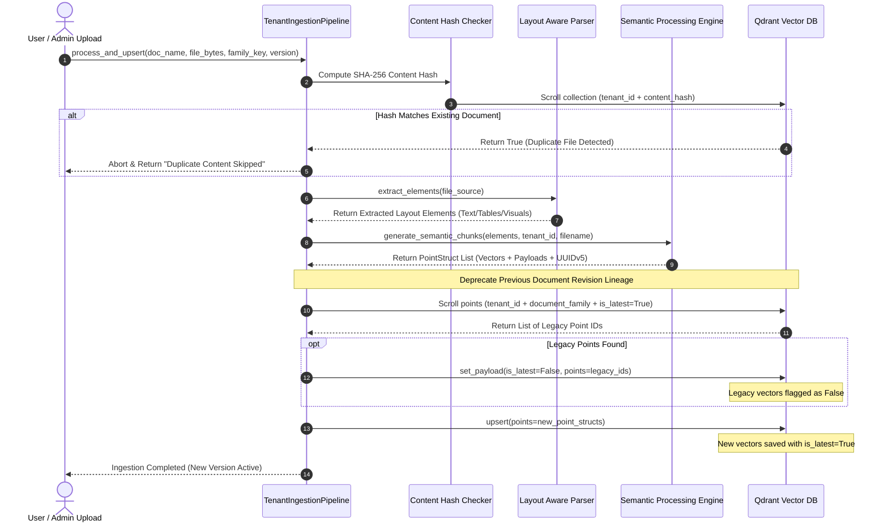
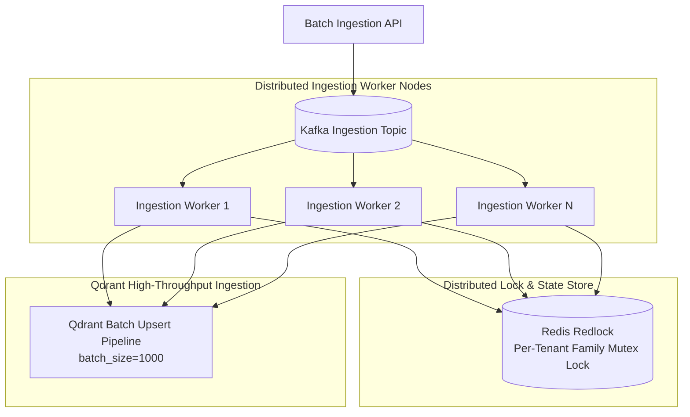

# 🔄 Ingestion Pipeline, Deduplication & Version Lineage Engine (`ingest_pipeline.py`)

The **Tenant Ingestion Pipeline** coordinates document parsing, semantic chunking, embedding generation, deterministic chunk deduplication, document revision lineage deprecation, and upsertion into the Qdrant vector database under strict logical tenant isolation.

---

## 📌 1. What & Why?

### What it Does
* Manages end-to-end document lifecycle for enterprise tenants (`tenant_id`).
* Computes **SHA-256 Content Hashes** to instantly detect duplicate file uploads.
* Tracks **Document Families**: Groups related document revisions (e.g. `Q3_Financials_v1.pdf`, `Q3_Financials_v2.pdf`).
* Performs **Automatic Document Lineage Deprecation**: When a new version of an existing document family is ingested, it searches Qdrant for all previous chunks belonging to that tenant and family, setting their payload flag `"is_latest": False`.
* Enforces **Deterministic Chunk Deduplication via UUIDv5**: Computes chunk point IDs using DNS namespace hashing on `f"{tenant_id}:{filename}:{chunk_text}"`, guaranteeing that re-ingesting the exact same content replaces vectors cleanly without duplication.

### Why We Built It This Way
Enterprise knowledge bases evolve continuously. Without automated version lineage and deduplication:
1. **Outdated Answers (Stale Context)**: If a company updates its HR policies or Q3 financial forecasts, querying the system returns a mix of old and new data, leading to conflicting LLM responses.
2. **Database Bloat**: Re-uploading files creates millions of duplicate vectors, wasting RAM and degrading vector search latency.
3. **Hard Deletes Are Risky**: Completely deleting old document vectors destroys audit trails and historical compliance logs.

Our solution keeps historical vectors intact in Qdrant, but flags them with `"is_latest": False`. RAG queries filter automatically on `{"is_latest": True}`, ensuring 100% accurate, up-to-date responses with full auditability!

---

## 🏛️ 2. Architectural Data Flow & Lineage Lifecycle



---

## 🔍 3. How It Works: Technical Deep-Dive

### A. SHA-256 Content Hash Verification
Before parsing heavy PDF layouts, the pipeline computes a cryptographic hash of the input file buffer:
```python
content_hash = hashlib.sha256(file_bytes).hexdigest()
if self._check_content_hash_exists(content_hash):
    return "Content hash matches existing document. Skipped."
```

### B. Document Revision Lineage Deprecation
When a document is marked as an update to an existing family:
```python
def _deprecate_existing_versions(self, document_family: str):
    offset = None
    while True:
        points, offset = self.client.scroll(
            collection_name=Config.COLLECTION_NAME,
            scroll_filter=Filter(
                must=[
                    FieldCondition(key="tenant_id", match=MatchValue(value=self.tenant_id)),
                    FieldCondition(key="document_family", match=MatchValue(value=document_family)),
                    FieldCondition(key="is_latest", match=MatchValue(value=True))
                ]
            ),
            limit=1000,
            offset=offset,
            with_payload=False
        )
        if points:
            point_ids = [pt.id for pt in points]
            self.client.set_payload(
                collection_name=Config.COLLECTION_NAME,
                payload={"is_latest": False},
                points=point_ids
            )
        if offset is None:
            break
```

### C. Deterministic UUIDv5 Point ID Generation
To ensure point ID uniqueness and zero database duplication across retries:
```python
import uuid
NAMESPACE_DNS = uuid.NAMESPACE_DNS
chunk_uuid = str(uuid.uuid5(NAMESPACE_DNS, f"{tenant_id}:{filename}:{chunk_text}"))
```
Because Qdrant uses point IDs as primary keys, upserting a point with an existing `UUIDv5` overwrites the payload seamlessly without increasing collection size.

---

## ⚡ 4. How to Scale Ingestion Pipeline to 100,000 PDFs

Executing version checks, scroll deprecations, and vector upserts across **100,000 PDFs** requires an enterprise transaction strategy:



### Key Scaling Interventions:
1. **Redis Redlock for Race-Condition Safeguards**:
   * When multiple workers process document revisions for the same tenant simultaneously, a Redis distributed lock (`redlock:tenant_id:doc_family`) prevents concurrent deprecation race conditions.
2. **Qdrant Batch Parallel Upserts**:
   * Group vector points into batches of 1,000 points per HTTP request (`client.upsert(points=batch)`).
   * Achieves **10,000+ vector upserts per second** into Qdrant cluster nodes.
3. **Dead-Letter Queue (DLQ) & Status Webhooks**:
   * Failed ingestion attempts trigger automatic retries (up to 3 times) before pushing to a DLQ and emitting an HTTP webhook notification to the enterprise monitoring system.
