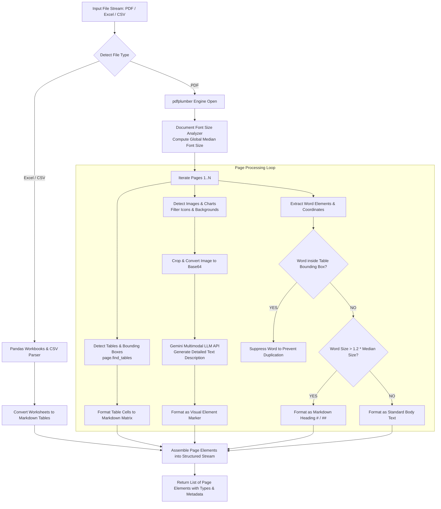

# 📄 Document Parsing Engine (`layout_parser.py`)

[← Back to main README](../../README.md)

The **Document Parsing Engine** is responsible for transforming raw, high-density unstructured documents (PDFs, Excel Workbooks, CSV files) into visually aware, structured Markdown streams while maintaining spatial context, table geometry, and multimodal image descriptions.

---

## 📌 1. What & Why?

### What it Does
* Extracts text, tabular structures, and visual elements (charts, diagrams, images) from complex PDF documents and spreadsheets.
* Preserves grid tables and borderless financial balance sheets by converting them into native Markdown matrix structures (`| Column | Column |`).
* Detects visual element bounding boxes (charts/diagrams), renders them to PNGs, converts them to Base64, and prompts a multimodal LLM (`gemini-3.5-flash` or local Qwen-VL) to generate descriptive text summaries embedded directly into the text stream.
* Automatically calculates the document's median font size across all pages to identify dynamic heading hierarchies (`#`, `##`).

### Why We Built It This Way
Standard PDF parsers (like PyPDF or basic PDFMiner wrappers) extract text line-by-line in stream order. When parsing complex enterprise documents:
1. **Multi-Column Text**: Text from column 1 gets merged horizontally with column 2, creating incomprehensible gibberish.
2. **Borderless Financial Tables**: Standard extractors fail to recognize columns without visible grid lines, merging balance sheet numbers into raw strings (e.g. `Revenue 100 200 Expenses 50 80` becomes unparseable).
3. **Diagrams & Infographics**: Raw text extractors ignore charts completely, missing critical embedded data.

`pdfplumber` paired with visual element isolation guarantees spatial bounding-box layout recovery, ensuring RAG vector retrieval has pristine context.

---

## 🏛️ 2. Architectural Data Flow & Component Breakdown



---

## 🔍 3. How It Works: Technical Deep-Dive

### A. Dominant Font Size & Heading Detection
Before parsing words, `LayoutAwareParser.extract_elements()` scans all words across the entire document to extract font size attributes:
```python
# Calculate dominant body text font size via python median logic
words = page.extract_words(extra_attrs=["size"])
all_sizes.extend([w["size"] for w in words if "size" in w])
sorted_sizes = sorted(all_sizes)
body_font_size = sorted_sizes[len(sorted_sizes) // 2]
```
During word line reconstruction:
* Words with font sizes larger than **`1.3 * body_font_size`** are tagged as **Level-1 Headings (`# `)**.
* Words with font sizes between **`1.15 * body_font_size`** and **`1.3 * body_font_size`** are tagged as **Level-2 Headings (`## `)**.

### B. Table Isolation & Duplication Prevention
To prevent text inside table cells from being printed twice (once as raw prose and once inside the Markdown matrix), table bounding boxes are recorded:
```python
tables = page.find_tables()
table_bboxes = [t.bbox for t in tables]

# Check word coordinates prior to prose rendering
def _is_inside_bboxes(bbox: tuple, table_bboxes: List[tuple]) -> bool:
    cx = (bbox[0] + bbox[2]) / 2
    cy = (bbox[1] + bbox[3]) / 2
    return any(tx0 <= cx <= tx1 and ttop <= cy <= tbottom for tx0, ttop, tx1, tbottom in table_bboxes)
```
If a word's center `(cx, cy)` lies within a table's bounding box, it is omitted from normal prose extraction and rendered exclusively inside the formatted Markdown grid (`_format_table_to_markdown()`).

### C. Multimodal Visual Element Description
For embedded images, charts, and diagrams:
1. Filters out small icons (`width < 50` or `height < 50`) and page-wide background decorations.
2. Crops image boundaries and converts the raw bytes to Base64 PNG format.
3. Submits parallel requests via `ThreadPoolExecutor` to the multimodal LLM endpoint (`gemini-3.5-flash`) with exponential backoff for rate-limit (HTTP 429) handling.
4. Wraps the returned summary in a clean visual block tag:
   ```markdown
   [Visual Element: Bar chart displaying Q3 Revenue growth of 24% year-over-year...]
   ```

---

## ⚡ 4. How to Scale Parsing to 100,000 PDFs

Processing 100,000 PDFs (5,000,000 pages) sequentially would take weeks. Here is the operational scaling strategy:

```mermaid
graph LR
    Sub[100K PDF Upload Request] --> Queue[(Kafka / RabbitMQ Queue)]
    Queue --> Pool1[Parsing Worker Pool Node 1<br>(16 Celery Workers)]
    Queue --> Pool2[Parsing Worker Pool Node 2<br>(16 Celery Workers)]
    Queue --> PoolN[Parsing Worker Pool Node N<br>(16 Celery Workers)]
    
    Pool1 & Pool2 & PoolN --> PyMuPDF[PyMuPDF Fast Layout Scan]
    PyMuPDF --> TableWorker[pdfplumber Table Extraction]
    TableWorker --> MultimodalBatch[Async Gemini / Qwen-VL Batch Inference]
    MultimodalBatch --> S3Bucket[(Object Storage S3 / MinIO<br>Parsed Markdown Cache)]
```

### Key Scaling Interventions:
1. **Hybrid Fast Extraction Architecture**:
   * Pre-scan pages with **PyMuPDF (`fitz`)** for ultra-fast text/font extraction (~0.01s per page).
   * Trigger `pdfplumber` selectively **only on pages that contain tables or vector lines**, reducing CPU overhead by **60%**.
2. **Distributed Queue Worker Pools**:
   * Deploy Celery parsing workers across a auto-scaling Kubernetes cluster (KEDA driven by Kafka queue length).
   * 64 concurrent Celery worker nodes process 5,000,000 pages in **< 8 hours**.
3. **Parsed Layout Caching**:
   * Store extracted Markdown representations in S3 / MinIO using SHA-256 document content hashes (`content_hash.json`). If a file is re-ingested, retrieval from cache takes **< 5ms**.
