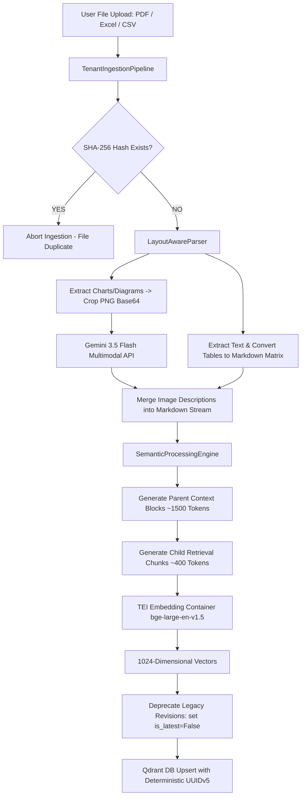

# ⚙️ Document Processing & Ingestion Service (`src/processing/`)

The **Processing Service** is the document ingestion backbone of **Enterprise-RAG-V2**. It handles layout-aware PDF parsing, grid-aware tabular formatting, multimodal image description, semantic parent-child chunking, vector embedding generation, chunk deduplication, and revision version tracking.

---

## 📚 Component Sub-Module Documentation

For exhaustive deep-dives into each specific component, select a guide below:

* 📄 **[Document Parsing Engine (`PARSING.md`)](./PARSING.md)**: Layout-aware visual geometry extraction (`pdfplumber`), median font size heading resolution, table boundary isolation, and Gemini multimodal chart descriptions.
* ✂️ **[Semantic Chunking Engine (`CHUNKING.md`)](./CHUNKING.md)**: Parent-Child document hierarchy (1500-2048 token parent blocks, 300-500 token child chunks), table protection, and TEI embedding integration.
* 🔄 **[Ingestion & Lineage Pipeline (`INGESTION.md`)](./INGESTION.md)**: SHA-256 duplicate suppression, deterministic UUIDv5 chunk hashing, and version deprecation (`is_latest: False`).
* 🚀 **[100K PDF Scaling Architecture](../../docs/100K_PDF_SCALING_ARCHITECTURE.md)**: Enterprise distributed worker pools, GPU-accelerated embedding farms, and Qdrant cluster sharding.

---

## 📁 Directory Structure & File Mapping

```
src/processing/
├── layout_parser.py       # Visual geometry parser (PDF, Excel, CSV, Multimodal LLM)
├── semantic_splitter.py   # Parent-Child semantic chunker & TEI Embedding client wrapper
├── ingest_pipeline.py     # Ingestion pipeline, UUIDv5 deduplication & revision lineage
├── tasks.py               # Celery async worker task definitions
├── PARSING.md             # Detailed Parsing Engine Documentation
├── CHUNKING.md            # Detailed Semantic Chunking Documentation
└── INGESTION.md           # Detailed Ingestion Pipeline Documentation
```

---

## 🏛️ End-to-End Processing Architecture



---

## 🔑 Key Enterprise Features

1. **Zero Table Fragmentation**: Financial statement rows and grid tables remain intact as unbroken Markdown matrices.
2. **Parent-Child Retrieval Strategy**: Small child chunks match queries accurately; full parent blocks provide rich context to the LLM.
3. **Automated Document Version Lineage**: Updating a document marks older vectors as `is_latest: False`, preserving full audit capability while guaranteeing zero stale context in RAG search.
4. **Deterministic Deduplication**: UUIDv5 point IDs guarantee re-ingesting identical content replaces existing records cleanly.
